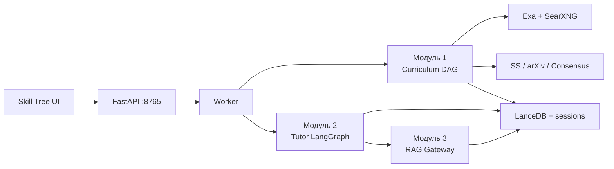

# REsearch — Knowledge Engine

Локальный инженерный **Knowledge Engine**: из цели собирает учебный DAG, ищет источники (Exa + SearXNG + академика), затем ведёт интерактивного тьютора по ноде с RAG и structured JSON.

Две линии продукта:

| Линия | Что это | UI |
|-------|---------|-----|
| **Skill Tree / Tutor** | Curriculum → нода → чат / лекция / mastery | `/app/skill-tree` |
| **Research graphs v0.4–v0.8** | Декомпозиция → поиск горизонтов → матрица / Consensus | `/app`, CLI analyses |

Каталог документации и аудит пробелов: [knowledge_engine/docs/INDEX.md](knowledge_engine/docs/INDEX.md).  
Пакетный README (legacy CLI / Docker): [knowledge_engine/README.md](knowledge_engine/README.md).

---

## Быстрый старт

```bash
cp .env.example .env          # ключи только локально, в git не коммитятся
make setup                    # SearXNG + Ollama + Python venv
make dev                      # API + worker → http://127.0.0.1:8765
```

| URL | Назначение |
|-----|------------|
| http://127.0.0.1:8765/app/skill-tree | Учебный граф и тьютор |
| http://127.0.0.1:8765/docs | OpenAPI |
| http://127.0.0.1:8765/api/v1/health | `worker_ok`, `redis_ok` |

Пошаговый запуск: [DEV_RUNBOOK.md](knowledge_engine/docs/DEV_RUNBOOK.md). Docker-схема: [DOCKER_LAYOUT.md](knowledge_engine/docs/DOCKER_LAYOUT.md).

Секреты: только `.env.example` в git. Браузерные профили, LanceDB, `.runs/` — в `.gitignore`.

---

## Общая архитектура



Три учебных модуля живут в одном API/worker; research-графы (v0.7/v0.8) — отдельный оркестратор. Научная ветка (papers) и практическая (блоги) **разделены**.

| Модуль | Роль | Документ |
|--------|------|----------|
| **1. Curriculum** | Model-First DAG → риск BASE/DEEP → targeted search → grounding | [CURRICULUM_MODULE_1.md](knowledge_engine/docs/CURRICULUM_MODULE_1.md) |
| **2. Node Deep-Dive** | LangGraph тьютор: eval → router → tutor/dense → commit | [NODE_DEEP_DIVE_MODULE_2.md](knowledge_engine/docs/NODE_DEEP_DIVE_MODULE_2.md) |
| **3. RAG Gateway** | Directional retrieval без LLM (embed + CE) | [RAG_GATEWAY_MODULE_3.md](knowledge_engine/docs/RAG_GATEWAY_MODULE_3.md) |

Живая карта пайплайнов (create / expand / нода): [TUTOR_PIPELINES.md](knowledge_engine/docs/TUTOR_PIPELINES.md).

---

## Skill Tree — подробнее

### Генерация маршрута (Модуль 1)

По умолчанию **Targeted Node Grounding**: Flash строит DAG без URL → Lite классифицирует ноды BASE/DEEP → веб-поиск **только для DEEP**.

`source_policy`: `hybrid` | `practical_only` | `academic_only`. В UI «Consensus» часто = `academic_only` + `generation_mode=consensus`.

**Практика (блоги / engineering):** **Exa** (6 векторов EN/RU, whitelist) → добор **SearXNG**. [EXA_SEARCH.md](knowledge_engine/docs/EXA_SEARCH.md).

**Наука (статьи):** цель **переформулируется** в English literature query, затем papers. Полный поток: [ACADEMIC_AND_CONSENSUS.md](knowledge_engine/docs/ACADEMIC_AND_CONSENSUS.md).

Expand: `POST /curriculum/expand` — не перезапускает grounding существующих нод.

Пул провайдеров и квоты: [SOURCE_POOL.md](knowledge_engine/docs/SOURCE_POOL.md).

#### Переформулирование запросов

Русская цель ноды не уходит в поисковики as-is. Три Lite-архитектора:

| Куда | Что делает Lite |
|------|-----------------|
| Exa / SearXNG практика | engineering-векторы, не API docs |
| Semantic Scholar / arXiv | `academic_query_en` + структурированные `arxiv_params` |
| Consensus.app | sanitize: **preserved_terms** (RPG, LLM, RAG…) verbatim, фразы из SearXNG grounding, без железа/проекта |

Consensus: `sanitize_query_for_consensus` → `AcademicQueryContract`. Anchor — только вопрос пользователя (без Light RAG).

#### Сбор papers

`fetch_academic_sources_async`:

1. **Semantic Scholar** → hydrate → hybrid rerank (relevance / trust / citations / recency).
2. **SearXNG science** (arxiv + Google Scholar; не bing/google).
3. **arXiv** с cascade relaxation, если пул тонкий.
4. **Consensus harvest** — обязателен для SotA/R&D нод; иначе fallback, если мало hits. Выкл. при `practical_only` или `CURRICULUM_USE_V08_CONSENSUS=false`.

Harvest: sanitize → Consensus (Direct API / Playwright) → пул `ScholarPaper` → браузер отпускается → Lite **validate** (OK / RETRY refinement / REJECT) → SS enrich → PDF/body → Gemma ingest → LanceDB. Логин: `./knowledge_engine/scripts/consensus-login.sh`. Транспорт API: [CONSENSUS_API_DIRECT.md](knowledge_engine/docs/CONSENSUS_API_DIRECT.md).

On-demand: reuse уже проиндексированных papers, live Consensus только при нехватке.

Лекция Stage 2 (внешние verified URL): Exa → параллельно SS + Consensus на EN-запросе.

### Тьютор ноды (Модуль 2)

Фасад `run_node_deep_dive` → `get_compiled_tutor_graph().ainvoke`.  
`thread_id` = `anchor` (`node_deep_dive:{curriculum_id}:{node_id}`), checkpoint `MemorySaver`.

Поток chat/verify: `ingest` → `step_analysis` → `sub_concept_eval` → `coverage_router` → `tutor` \| `dense` → `commit` → `persist` → `finalize`.

**Инвариант coverage:** LLM не пишет статусы карты; `sub_concept_eval` предлагает, `commit_turn` фиксирует `concept_map_state`.

Контракт диалога `DeepDiveTutorContract`: `feedback_on_answer` + `technical_explanation` + `follow_up_question` (поля `tutor_message` в JSON модели нет).  
Промпты и BLOCK 1–3 (Gemini prefix cache): [TUTOR_PROMPT_AND_UI_TEXT.md](knowledge_engine/docs/TUTOR_PROMPT_AND_UI_TEXT.md).  
Реестр всех structured-схем: [LLM_CONTRACTS.md](knowledge_engine/docs/LLM_CONTRACTS.md).

Плотная лекция: LanceDB hybrid → Cross-Encoder → MMR → `[R*]` чанки. [LECTURE_RAG_CONTEXT.md](knowledge_engine/docs/LECTURE_RAG_CONTEXT.md).  
Диаграммы / ETL фигур: [ARTICLE_DIAGRAMS.md](knowledge_engine/docs/ARTICLE_DIAGRAMS.md), [ARTICLE_ETL_AND_FIGURE_EXTRACTION.md](knowledge_engine/docs/ARTICLE_ETL_AND_FIGURE_EXTRACTION.md).

UI drawer, SSE explain (`[R*]` важнее `[S*]`): [SKILL_TREE_UI.md](knowledge_engine/docs/SKILL_TREE_UI.md).

**Host-слой (в коде, канон docs ещё тонкий):** чипы Gloss / HOW / MECH / lecture; vector intent (LanceDB); задачки со звёздочкой (Star Task FSM L4/L5); Socratic poles; weakness ledger. Список: [INDEX.md](knowledge_engine/docs/INDEX.md).

### Память и RAG (Модуль 3)

На init/chat — directional RAG в сжатый профиль сессии. Без LLM на брокере.  
Сессии тьютора: `knowledge_engine/.runs/node_deep_dive_sessions.json`.  
Графы: `knowledge_engine/.runs/skill_tree_curricula.json`.  
Курация URL: Lite source evaluator + whitelist ([SOURCE_POOL.md](knowledge_engine/docs/SOURCE_POOL.md)).

---

## Research-графы (v0.4–v0.8)

Отдельный продукт: архитектурный разбор **одной задачи** (не учебный DAG). UI `/app`.

| Версия | Суть | Документ |
|--------|------|----------|
| v0.4–0.6 | SearXNG + Domain Trust + Gemini matrix / unravel | [V0_6_CURRENT_SOLUTION.md](knowledge_engine/docs/V0_6_CURRENT_SOLUTION.md) |
| Frugal | SLM router + Gemini heavy | [FRUGAL_ROUTING.md](knowledge_engine/docs/FRUGAL_ROUTING.md) |
| Горизонты | SOTA / Infra / Prod (discovery, не категории матрицы) | [SEARCH_HORIZONS.md](knowledge_engine/docs/SEARCH_HORIZONS.md) |
| v0.7 | Light RAG analytics (L2a–L2c) | [V0_7_ARCHITECTURE.md](knowledge_engine/docs/V0_7_ARCHITECTURE.md) |
| **v0.8** | тот же Consensus-sanitize → papers → validate → Reasoner | [V0_8_CONSENSUS_AGENT.md](knowledge_engine/docs/V0_8_CONSENSUS_AGENT.md) |

`GRAPH_VERSION` переключает **research-оркестратор**. Skill Tree от него не зависит; curriculum Consensus — `CURRICULUM_USE_V08_CONSENSUS`. Prep запроса (preserved terms, grounding, Lite sanitize) **общий** с научной веткой курса.

---

## Стек и процессы

| Компонент | Где |
|-----------|-----|
| FastAPI | хост, порт 8765 |
| Worker | отдельный процесс (`make dev` / `make worker`); без него `POST /curriculum/*` и `/node/*` → 503 |
| Redis | опц. очередь + логи (`REDIS_URL`) |
| SearXNG | Docker `:8080` |
| Ollama | хост (embeddings, SLM, summarizer) |
| Gemini | structured JSON тьютора / curriculum / research; квоты: `gemini_quota_store` |
| Exa | neural search по whitelist (практика) |
| Consensus.app | papers: Direct API + Playwright session |
| Semantic Scholar / arXiv | academic primary + fallback |
| LanceDB | чанки статей, RAG, intent / socratic / edge-case векторы |

Конфигурация: `knowledge_engine/config.py`, шаблон `.env.example`, обзор [ENV_VARIABLES.md](knowledge_engine/docs/ENV_VARIABLES.md).

---

## Качество кода

```bash
source .venv/bin/activate
export PYTHONPATH="$(pwd)"
pip install -r knowledge_engine/requirements-dev.txt
make format    # black + isort
make lint      # flake8
make check     # format --check + lint
make skill-tree-ui   # после правок web/static/skill-tree/*.js
```

История изменений пакета: [knowledge_engine/CHANGELOG.md](knowledge_engine/CHANGELOG.md).

## GitHub

```bash
gh auth login
gh repo create REsearch --private --source=. --remote=origin --push
```
