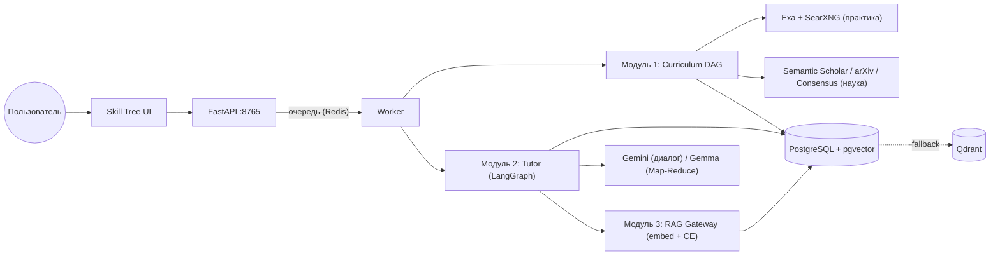

# REsearch — Knowledge Engine

[English version](README_EN.md)

> **Автономный движок обучения.** Превращает цель («Репликации и шардирование PostgreSQL») в структурированный учебный граф, заземляет его на реальных инженерных и научных источниках и доводит до усвоения через интерактивного тьютора. Прогресс по каждой подтеме считает код, а не языковая модель.

**Стек:** Python 3.10+ · FastAPI · LangGraph · Pydantic v2 · PostgreSQL + pgvector (Qdrant как fallback) · Redis · Gemini + Gemma · Ollama · React 18 / XYFlow

Быстрая навигация: [где что читать](#-навигация-по-документации) · [запуск](#-quick-start) · [замеры](#-инженерные-решения-и-замеры)

---

## Почему обычный чат с RAG здесь не работает

Типичный «чат по документам» ломается на длинном обучении по одним и тем же причинам. Ниже — что именно делает Knowledge Engine в каждом из этих мест.

| Проблема обычного RAG | Что делает Knowledge Engine |
|---|---|
| В промпт попадает всё «похожее», включая шум и дубли | Многоступенчатая фильтрация с отсечкой по перепаду релевантности; если хорошего чанка нет, результат пустой, а не «лучший из плохих» |
| Модель сама себя оценивает и подстраивается под ответ | Генерацию и оценку выполняют разные вызовы; статусы мастерства пишет код |
| Оценщик занижает балл за то, о чём не спрашивали | Context-Bounded Evaluation: глубина ответа ограничена слоем вопроса |
| Поисковик получает русскую формулировку «как есть» | Три Lite-архитектора переводят цель ноды в запросы под каждый контур поиска |
| Долгий Map-Reduce блокирует чат | Тяжёлая обработка идёт асинхронно в worker, диалог не ждёт |
| Запреты в промпте модель «забывает» | Запрет физически невозможно нарушить: поля нет в Pydantic-схеме |

---

## 🧭 Пользовательский опыт: две независимые оси

Путь пользователя: **цель → учебный граф → нода → тьютор**. Режимы выбираются двумя независимыми осями.

### Управление графом (Control Axis)

| Режим | Что происходит |
|---|---|
| **Autopilot** (по умолчанию) | Граф строится автоматически, глубокие (DEEP) ноды заземляются сами при первом открытии |
| **Штурвал** (Steering) | Вы утверждаете источники руками на двух шагах. Mode 1 (`per_node`) строит курс как Autopilot, но с утверждением источников для глубокой ноды. Mode 2 (`standalone_digest`): теги и хабы → **Gate 1** (вы выбираете статьи) → дайджесты → **Gate 2** (вы утверждаете) → Map-Reduce строго по утверждённым статьям → одна глубокая нода |

Кандидатов для Штурвала ищут по хабам компаний: для **Хабра** это RSS-ленты и **Exa**, рядом идут академические источники. Подробнее: [STEERING_AND_TOPIC_QNA_ROADMAP.md](knowledge_engine/docs/STEERING_AND_TOPIC_QNA_ROADMAP.md).

### Управление обучением (Interaction Axis)

| Режим | Опыт |
|---|---|
| **`lecture_self_check`** (по умолчанию) | Тьютор подаёт материал, задаёт проверочные вопросы, оценивает ответы отдельным модулем; мастерство копится по подтемам |
| **`topic_qna`** (консультант) | Свободные вопросы без квиза и без оценки; ответы остаются заземлёнными на материалах ноды. Вопрос тьютор задаёт только по кнопке «Самопроверка» |

Прогресс отслеживается по каждой подтеме отдельно (mastery).

---

## 🔎 Как цель превращается в заземлённые источники

Русская цель ноды не уходит в поисковики «как есть». Для DEEP-нод (BASE-ноды строятся без поиска) запускаются три Lite-архитектора запросов:

| Контур | Что делает архитектор | Источники |
|---|---|---|
| **Инженерный и сообщество** | Строит engineering-векторы, а не запросы к документации API | **Exa** (по whitelist блогов, включая Хабр) → добор **SearXNG** |
| **Научный** | Формирует `academic_query_en` и структурированные `arxiv_params`; при тонком пуле включается **relaxation cascade** (3 уровня) | **Semantic Scholar** + **arXiv** |
| **Consensus** | `sanitize_query_for_consensus`: убирает проектный шум, сохраняет жёсткие термины `preserved_terms` дословно | **Consensus** (Direct API или Playwright) |

**Validation Pass.** Найденные papers проходят Lite-валидацию (OK / RETRY с уточнением / REJECT) до ingest, так что спам и SEO-мусор в базу знаний не попадают.

**Ленивое заземление (lazy grounding).** При создании графа поиск не выполняется: Flash строит DAG без URL, Lite делит ноды на BASE и DEEP, а поиск и ingest запускаются только для DEEP при первом открытии. Граф из 10 нод создаётся за ~70 секунд.

Подробности: [CURRICULUM_MODULE_1.md](knowledge_engine/docs/CURRICULUM_MODULE_1.md), [EXA_SEARCH.md](knowledge_engine/docs/EXA_SEARCH.md), [ACADEMIC_AND_CONSENSUS.md](knowledge_engine/docs/ACADEMIC_AND_CONSENSUS.md), [SOURCE_POOL.md](knowledge_engine/docs/SOURCE_POOL.md).

---

## 🎯 Гарантия релевантности: как RAG отсекает шум

В системе две модели с разными ролями, обе локальные и без LLM:

| Модель | Роль | Где работает |
|---|---|---|
| **`BAAI/bge-m3`** (`EMBED_MODEL`, Bi-Encoder) | Эмбеддинги и векторный поиск кандидатов (HNSW в pgvector, Qdrant как fallback) | Весь retrieval; оценка близости чанков в лекции |
| **`BAAI/bge-reranker-v2-m3`** (`RAG_CROSS_ENCODER_MODEL`, Cross-Encoder) | Точное ранжирование пар «запрос ↔ текст»; логиты приводятся к [0, 1] через сигмоиду | RAG Gateway, pre-flight triage поисковой выдачи, дайджесты и Gate 2 Штурвала, REDUCE-дедуп, запасная цепочка лекции |

Если Cross-Encoder недоступен, ранжирование деградирует до cosine BGE-M3.

**RAG Gateway (Модуль 3)** — брокер на init ноды и при пробелах: по каждому направлению поиска берётся топ-5 векторных кандидатов, затем Cross-Encoder оценивает их относительно критерия релевантности, отсекается всё ниже порога (`RAG_DEFAULT_MIN_RELEVANCE`), после чего идут дедуп (перекрытие > 90%) и топ фактов. Ни одного LLM-вызова.

**Подбор контекста для плотной лекции.** Основной путь опирается на BGE-M3, а Cross-Encoder в нём не участвует:
1. **Векторный пул** кандидатов плюс закреплённые (pinned) источники.
2. **Оценка:** `α·cos(чанк, тема) + β·cos(паспорт документа, тема)`.
3. **Knee-cutoff:** срез хвоста в точке, где перепад между соседними оценками ≥ 12% от лучшей. Если лучший ниже пола `0.30`, результат пустой: честное «данных нет», а не подмена.
4. **Выбор:** при лучшем совпадении ≥ 0.70 берётся документ-якорь с добавкой чанков, иначе **MMR** по разным источникам (не больше 2 чанков на источник).
5. **Semantic dedup** (0.85) убирает смысловые дубли.
6. **Positional reorder** (Lost in the Middle): два лучших чанка ставятся в начало и в конец промпта.

При ошибке или пустом выборе включается запасная цепочка **Cross-Encoder (`bge-reranker-v2-m3`) → порог 0.50 → MMR**. Для пер-ходового RAG по атомам знаний Cross-Encoder подключается опционально (флаги `DIALOG_ATOMS_*`, по умолчанию выключены).

Параметры и логи: [LECTURE_RAG_CONTEXT.md](knowledge_engine/docs/LECTURE_RAG_CONTEXT.md) (описание части параметров ещё не обновлено под pgvector), [RAG_GATEWAY_MODULE_3.md](knowledge_engine/docs/RAG_GATEWAY_MODULE_3.md).

---

## ⚙️ Экономика и скорость LLM

- **Async Map-Reduce на Gemma.** Глубокие ноды обрабатываются в worker: MAP-окна по 2 800 токенов с границами по AST (детерминированный TPM-бюджет), затем двухфазный REDUCE. Диалог с тьютором в это время не блокируется. Общий rate limiter объединяет Gemma primary и fallback, а Pre-MAP Dedup не тратит Map-Reduce на источник, уже дублирующий другой в батче. Обоснование окна: [ARCHITECTURE_DECISIONS.md](knowledge_engine/docs/ARCHITECTURE_DECISIONS.md), раздел «Модуль 3 — RAG».
- **Prompt-архитектура под Gemini prefix cache.** Промпт тьютора разложен на блоки: **BLOCK 1** (persona, правила, JSON-контракт) — стабильный префикс, **BLOCK 2** (материалы ноды, `[R*]`, `[S*]`, fact manifest, concept map) — полустатический, **BLOCK 3** (история чата и ход пользователя) — динамический хвост. Для диалога используются явные cache-слои. Экономия токенов в перфоманс-логах пока не измерена (`cached_content_token_count` не пишется), поэтому цифр здесь нет: [TUTOR_PROMPT_AND_UI_TEXT.md](knowledge_engine/docs/TUTOR_PROMPT_AND_UI_TEXT.md).

---

## 🎓 Тьютор, Оценщик и детерминированный граф

- **Генерация отделена от оценки.** Тьютор пишет материал и вопросы. Ответы проверяет отдельный модуль `sub_concept_eval`. Тьютор не оценивает сам себя.
- **Context-Bounded Evaluation (Scope Ceiling).** Оценщик судит ответ строго в рамках слоя абстракции последнего вопроса. Пропущенная незапрошенная глубина ошибкой не считается, а Question Factory фиксирует границы критериев прямо в тексте вопроса.
- **Код управляет состоянием.** LLM не пишет статусы карты. `sub_concept_eval` предлагает оценку, `commit_turn` фиксирует состояние в `concept_map_state`.
- **Инвариант в схеме.** Для `topic_qna` отдельные контракты без поля вопроса: тьютор физически не может задать проверочный вопрос.
- **Контроль порядка полей.** Контракты ответа упорядочены по ярусам (план → сообщение → материалы → системные поля), поэтому пользователь получает ответ в том порядке, в каком его читает.

Поток хода: `ingest → step_analysis → sub_concept_eval → coverage_router → tutor | dense → commit → persist → finalize` (чекпоинт `MemorySaver`). См. [NODE_DEEP_DIVE_MODULE_2.md](knowledge_engine/docs/NODE_DEEP_DIVE_MODULE_2.md), [LLM_CONTRACTS.md](knowledge_engine/docs/LLM_CONTRACTS.md).

---

## 🏗️ Архитектура и стек


```mermaid
flowchart LR
  User(("Пользователь")) --> UI["Skill Tree UI"]
  UI --> API["FastAPI :8765"]
  API -->|"очередь (Redis)"| W["Worker"]
  W --> M1["Модуль 1: Curriculum DAG"]
  W --> M2["Модуль 2: Tutor (LangGraph)"]
  M2 --> M3["Модуль 3: RAG Gateway (embed + CE)"]
  M1 --> Prac["Exa + SearXNG (практика)"]
  M1 --> Acad["Semantic Scholar / arXiv / Consensus (наука)"]
  M1 --> PG[("PostgreSQL + pgvector")]
  M2 --> PG
  M3 --> PG
  PG -.->|"fallback"| Q[("Qdrant")]
  M2 --> LLM["Gemini (диалог) / Gemma (Map-Reduce)"]
```

Тяжёлые модели (BGE-M3, Cross-Encoder) загружаются только в worker. API работает через очередь; без worker `/curriculum/*` и `/node/*` отвечают 503.

| Компонент | Роль |
|---|---|
| FastAPI | HTTP/SSE-интерфейс, постановка задач |
| Worker + Redis | Выполнение тяжёлых задач, очередь и стриминг |
| LangGraph | Граф тьютора и его состояние |
| Pydantic v2 | Контракты structured-ответов LLM |
| PostgreSQL + pgvector | Векторное хранилище (HNSW); Qdrant как запасной бэкенд |
| Gemini / Gemma | Диалог и оценка / асинхронный Map-Reduce |
| Ollama | Локальные embeddings и summarizer |
| Exa, SearXNG, Semantic Scholar, arXiv, Consensus | Поисковые контуры |
| React 18 + XYFlow | Skill Tree UI |

Карта пайплайнов: [TUTOR_PIPELINES.md](knowledge_engine/docs/TUTOR_PIPELINES.md). Docker: [DOCKER_LAYOUT.md](knowledge_engine/docs/DOCKER_LAYOUT.md).

---

## 🛡️ Инженерные решения и замеры

**Реестр решённых проблем**

| Проблема | Решение |
|---|---|
| Шум и подмена «данных нет» в контексте | Knee-cutoff, пол 0.30, semantic dedup, positional reorder |
| Оценщик карает за неспрошенное | Scope Ceiling и scope-lock критериев |
| Тьютор задаёт вопрос там, где нельзя | Поле вопроса отсутствует в схеме (`topic_qna`) |
| Зацикливание самопроверки | Circuit breaker: после `TOPIC_QNA_SELF_CHECK_MAX_ATTEMPTS` (3) статус не меняется, тьютор отвечает без оценки; сброс ожидания при смене оси или запросе лекции |
| Битый или пустой ответ модели | JSON-repair, повтор при нарушении схемы (`contract_retry`), серверный fallback на пустой ответ |
| Сбой RAG-стадии | Таймауты стадий, откат на dedupe, деградация Cross-Encoder → cosine |
| Растущая история диалога | Гибридный буфер: сырой хвост, сжатая лента и блочное схлопывание через Gemma (по умолчанию выключено) |
| Изменения без регрессий | Add-only: Штурвал и Topic Q&A добавлены поверх Autopilot без правки старого поведения |

Полный список решений с обоснованиями: [ARCHITECTURE_DECISIONS.md](knowledge_engine/docs/ARCHITECTURE_DECISIONS.md).

**Замеры** (время worker-задач от `▶` до `✓`, `perf_debug.log`, 12–21.09.2026):

| Операция | Время |
|---|---|
| Генерация графа (10 нод, 3 вызова Gemini, поиск отложен) | ~70 s |
| Первое открытие DEEP-ноды (поиск, ingest, Map-Reduce на Gemma) | 6–9 мин в среднем |
| Ответ тьютора (worker-задача целиком) | медиана 19 s, максимум 72 s |

Два разобранных прогона DEEP-ноды (курс «Репликация и отказоустойчивость»): `connection_pooling_and_pgbouncer` — 576 s (23 LLM-вызова), `patroni_high_availability` — 405 s (22 вызова).

- Основная доля времени: Gemma MAP (~170 s) и REDUCE (~165–225 s), затем triage/ingest и BGE-поиск. Стадии частично параллельны (до 4 вызовов одновременно).
- Время вызова определяется размером выхода, а не входа: ~340 токенов выхода в секунду на `gemini-3.1-flash-lite`. Короткие вызовы (вход 0.4–1k, выход 0.1–0.4k токенов) занимают 2–17 s.
- В ответе тьютора около 30 s могут занимать локальный RAG и холодная загрузка BGE-M3 на первом запросе.
- Токены в логах оценочные (символы / 3.5). Метрик качества ответа (Precision@K и т. п.) в репозитории пока нет.

---

## 🚀 Quick Start

```bash
cp .env.example .env     # ключи только локально, в git не коммитятся
make setup               # SearXNG + Ollama + Python venv
make dev                 # API + worker → http://127.0.0.1:8765
```

| URL | Назначение |
|---|---|
| `/app/skill-tree` | Учебный граф и тьютор |
| `/docs` | OpenAPI |
| `/api/v1/health` | `worker_ok`, `redis_ok` |

Проверки: `make check` (black, isort, flake8), тесты по модулям, `tests/benchmarks/`. Трассировка стадий RAG и LLM-вызовов пишется в `perf_debug.log`; разбор: `knowledge_engine/scripts/legacy_research/log_profiler.py --llm-audit`. Конфигурация: `knowledge_engine/src/config/settings.py` (источник истины).

---

## 🗺️ Навигация по документации

Единый каталог с актуальностью каждого файла: [INDEX.md](knowledge_engine/docs/INDEX.md).

| Хочу узнать | Читать |
|---|---|
| Что это, без кода | [PRODUCT_OVERVIEW.md](knowledge_engine/docs/PRODUCT_OVERVIEW.md) |
| Зачем принято каждое решение | [ARCHITECTURE_DECISIONS.md](knowledge_engine/docs/ARCHITECTURE_DECISIONS.md) |
| Как строится граф | [CURRICULUM_MODULE_1.md](knowledge_engine/docs/CURRICULUM_MODULE_1.md), [TUTOR_PIPELINES.md](knowledge_engine/docs/TUTOR_PIPELINES.md) |
| Штурвал и Topic Q&A | [STEERING_AND_TOPIC_QNA_ROADMAP.md](knowledge_engine/docs/STEERING_AND_TOPIC_QNA_ROADMAP.md) |
| Как устроен тьютор | [NODE_DEEP_DIVE_MODULE_2.md](knowledge_engine/docs/NODE_DEEP_DIVE_MODULE_2.md), [TUTOR_PROMPT_AND_UI_TEXT.md](knowledge_engine/docs/TUTOR_PROMPT_AND_UI_TEXT.md) |
| Контракты LLM и промпты | [LLM_CONTRACTS.md](knowledge_engine/docs/LLM_CONTRACTS.md), [PROMPT_SYSTEM_REFERENCE.md](knowledge_engine/docs/PROMPT_SYSTEM_REFERENCE.md) |
| Поиск источников | [EXA_SEARCH.md](knowledge_engine/docs/EXA_SEARCH.md), [SOURCE_POOL.md](knowledge_engine/docs/SOURCE_POOL.md), [ACADEMIC_AND_CONSENSUS.md](knowledge_engine/docs/ACADEMIC_AND_CONSENSUS.md), [CONSENSUS_API_DIRECT.md](knowledge_engine/docs/CONSENSUS_API_DIRECT.md) |
| RAG и релевантность | [RAG_GATEWAY_MODULE_3.md](knowledge_engine/docs/RAG_GATEWAY_MODULE_3.md), [LECTURE_RAG_CONTEXT.md](knowledge_engine/docs/LECTURE_RAG_CONTEXT.md), [RAG_PIPELNES.md](knowledge_engine/docs/RAG_PIPELNES.md) |
| Обработка статей и кода | [ARCHITECTURE_DEDUP.md](knowledge_engine/docs/ARCHITECTURE_DEDUP.md), [CODE_TRIAGE_AND_PRUNING.md](knowledge_engine/docs/CODE_TRIAGE_AND_PRUNING.md), [ARTICLE_DIAGRAMS.md](knowledge_engine/docs/ARTICLE_DIAGRAMS.md) |
| UI | [SKILL_TREE_UI.md](knowledge_engine/docs/SKILL_TREE_UI.md) |
| Запуск и эксплуатация | [DEV_RUNBOOK.md](knowledge_engine/docs/DEV_RUNBOOK.md), [DOCKER_LAYOUT.md](knowledge_engine/docs/DOCKER_LAYOUT.md), [SCRIPTS.md](knowledge_engine/docs/SCRIPTS.md), [ENV_VARIABLES.md](knowledge_engine/docs/ENV_VARIABLES.md) |

---

## Roadmap

- **Лексический поиск.** `hybrid_search` сейчас векторный (HNSW), точные термины и идентификаторы теряются. Планируется `tsvector` плюс `pg_trgm` и RRF перед Cross-Encoder.
- **Contextual embeddings:** эмбеддить `window_summary` вместе с чанком.
- **Gold-набор и автоматическая оценка качества** (Precision@K, RAGAS).
- **Измерение эффекта prompt cache** (`cached_content_token_count`).

## Evolution

Проект вырос из research-графов v0.4–v0.8 (они остались отдельным оркестратором на `/app`: [V0_8_CONSENSUS_AGENT.md](knowledge_engine/docs/V0_8_CONSENSUS_AGENT.md)) в автономный Knowledge Engine с интерактивным тьютором. История изменений: [CHANGELOG.md](knowledge_engine/CHANGELOG.md).
