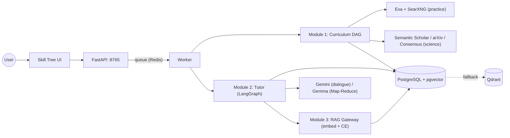

# REsearch — Knowledge Engine

[Русская версия](README.md)

> **An autonomous learning engine.** It turns a vague goal ("PostgreSQL replication and sharding") into a structured learning graph, grounds it on real engineering and scientific sources, and takes the learner to mastery through an interactive tutor. Per-sub-topic progress is computed by code, not by a language model.

**Stack:** Python 3.10+ · FastAPI · LangGraph · Pydantic v2 · PostgreSQL + pgvector (Qdrant as fallback) · Redis · Gemini + Gemma · Ollama · React 18 / XYFlow

Quick navigation: [where to read what](#-documentation-map) · [quick start](#-quick-start) · [engineering solutions and measurements](#-engineering-solutions-and-measurements)

> The linked documentation is in Russian.

---

## Why a plain RAG chat does not work here

A typical "chat with your documents" breaks down in long-form learning for the same reasons every time. Here is what Knowledge Engine does about each of them.

| Problem with plain RAG | What Knowledge Engine does |
|---|---|
| Everything "similar" lands in the prompt, including noise and duplicates | Multi-stage filtering with a cut at the relevance drop-off; if there is no good chunk, the result is empty rather than "the best of the bad" |
| The model grades itself and adapts to the answer | Generation and grading are separate calls; mastery statuses are written by code |
| The grader penalises what was never asked | Context-Bounded Evaluation: the accepted depth is capped at the layer of the question |
| The search engine gets the Russian wording as-is | Three Lite query architects translate the node goal into queries for each search circuit |
| A long Map-Reduce blocks the chat | Heavy processing runs asynchronously in a worker, the dialogue does not wait |
| The model "forgets" prohibitions in the prompt | A prohibition cannot be violated: the field does not exist in the Pydantic schema |

---

## 🧭 User experience: two independent axes

User path: **goal → learning graph → node → tutor**. Modes are chosen along two independent axes.

### Graph control (Control Axis)

| Mode | What happens |
|---|---|
| **Autopilot** (default) | The graph is built automatically; deep (DEEP) nodes ground themselves on first open |
| **Wheel** (Штурвал, Steering) | You approve the sources by hand in two steps. Mode 1 (`per_node`) builds the course like Autopilot, but with source approval for a deep node. Mode 2 (`standalone_digest`): tags and hubs → **Gate 1** (you pick articles) → digests → **Gate 2** (you approve) → Map-Reduce strictly over the approved articles → one deep node |

Wheel candidates are searched by company hubs: for **Habr** that means RSS feeds and **Exa**, with academic sources alongside. More: [STEERING_AND_TOPIC_QNA_ROADMAP.md](knowledge_engine/docs/STEERING_AND_TOPIC_QNA_ROADMAP.md).

### Learning control (Interaction Axis)

| Mode | Experience |
|---|---|
| **`lecture_self_check`** (default) | The tutor presents material, asks check questions, and a separate module grades the answers; mastery accumulates per sub-topic |
| **`topic_qna`** (consultant) | Free-form questions with no quiz and no grading; answers stay grounded in the node's materials. The tutor asks a question only via the "Self-check" button |

Progress is tracked per sub-topic (mastery).

---

## 🔎 How a goal becomes grounded sources

A Russian node goal never reaches the search engines as-is. For DEEP nodes (BASE nodes are built without search), three Lite query architects run:

| Circuit | What the architect does | Sources |
|---|---|---|
| **Engineering and community** | Builds engineering vectors rather than API-documentation queries | **Exa** (over a blog whitelist, including Habr) → **SearXNG** top-up |
| **Academic** | Produces `academic_query_en` and structured `arxiv_params`; a **relaxation cascade** (3 levels) kicks in when the pool is thin | **Semantic Scholar** + **arXiv** |
| **Consensus** | `sanitize_query_for_consensus`: strips project noise, keeps hard terms (`preserved_terms`) verbatim | **Consensus** (Direct API or Playwright) |

**Validation Pass.** Found papers go through Lite validation (OK / RETRY with refinement / REJECT) before ingest, so spam and SEO junk never reach the knowledge base.

**Lazy grounding.** No search runs when the graph is created: Flash builds the DAG without URLs, Lite splits nodes into BASE and DEEP, and search and ingest start only for DEEP nodes on first open. A 10-node graph is created in ~70 seconds.

Details: [CURRICULUM_MODULE_1.md](knowledge_engine/docs/CURRICULUM_MODULE_1.md), [EXA_SEARCH.md](knowledge_engine/docs/EXA_SEARCH.md), [ACADEMIC_AND_CONSENSUS.md](knowledge_engine/docs/ACADEMIC_AND_CONSENSUS.md), [SOURCE_POOL.md](knowledge_engine/docs/SOURCE_POOL.md).

---

## 🎯 Relevance guarantee: how RAG cuts the noise

The system uses two models with different roles, both local and LLM-free:

| Model | Role | Where it runs |
|---|---|---|
| **`BAAI/bge-m3`** (`EMBED_MODEL`, Bi-Encoder) | Embeddings and vector candidate search (HNSW in pgvector, Qdrant as fallback) | All retrieval; chunk-similarity scoring in the lecture |
| **`BAAI/bge-reranker-v2-m3`** (`RAG_CROSS_ENCODER_MODEL`, Cross-Encoder) | Precise ranking of "query ↔ text" pairs; logits are mapped to [0, 1] with a sigmoid | RAG Gateway, pre-flight triage of search results, Wheel digests and Gate 2, REDUCE dedup, the lecture's fallback chain |

If the Cross-Encoder is unavailable, ranking degrades to BGE-M3 cosine.

**RAG Gateway (Module 3)** is a broker used on node init and on gaps: for each search direction the top 5 vector candidates are taken, the Cross-Encoder scores them against the relevance criterion, everything below the threshold (`RAG_DEFAULT_MIN_RELEVANCE`) is dropped, then dedup (overlap > 90%) and the top facts follow. Not a single LLM call.

**Context selection for the dense lecture.** The main path relies on BGE-M3, and the Cross-Encoder does not take part in it:
1. **Vector pool** of candidates plus pinned sources.
2. **Score:** `α·cos(chunk, topic) + β·cos(document passport, topic)`.
3. **Knee-cutoff:** the tail is cut where the drop between neighbouring scores is ≥ 12% of the best one. If the best score is below the `0.30` floor, the result is empty: an honest "no data" instead of a substitute.
4. **Selection:** when the best match is ≥ 0.70, an anchor document plus supplementary chunks is taken; otherwise **MMR** across different sources (at most 2 chunks per source).
5. **Semantic dedup** (0.85) removes semantic duplicates.
6. **Positional reorder** (Lost in the Middle): the two best chunks go to the start and the end of the prompt.

On error or an empty selection a fallback chain runs: **Cross-Encoder (`bge-reranker-v2-m3`) → threshold 0.50 → MMR**. For per-turn RAG over knowledge atoms the Cross-Encoder is optional (`DIALOG_ATOMS_*` flags, off by default).

Parameters and logs: [LECTURE_RAG_CONTEXT.md](knowledge_engine/docs/LECTURE_RAG_CONTEXT.md), [RAG_GATEWAY_MODULE_3.md](knowledge_engine/docs/RAG_GATEWAY_MODULE_3.md).

---

## ⚙️ LLM economics and speed

- **Async Map-Reduce on Gemma.** Deep nodes are processed in the worker: 2,800-token MAP windows with AST-aligned boundaries (a deterministic TPM budget), then a two-phase REDUCE. The tutor dialogue is not blocked meanwhile. A shared rate limiter covers the Gemma primary and fallback models, and Pre-MAP Dedup avoids spending Map-Reduce on a source that already duplicates another one in the batch. Rationale for the window size: [ARCHITECTURE_DECISIONS.md](knowledge_engine/docs/ARCHITECTURE_DECISIONS.md), section "Module 3 — RAG".
- **Prompt architecture for the Gemini prefix cache.** The tutor prompt is split into blocks: **BLOCK 1** (persona, rules, JSON contract) is a stable prefix, **BLOCK 2** (node materials, `[R*]`, `[S*]`, fact manifest, concept map) is semi-static, **BLOCK 3** (chat history and the user turn) is the dynamic tail. The dialogue uses explicit cache layers. The token saving has not yet been measured in the performance logs (`cached_content_token_count` is not recorded), so there are no figures here: [TUTOR_PROMPT_AND_UI_TEXT.md](knowledge_engine/docs/TUTOR_PROMPT_AND_UI_TEXT.md).

---

## 🎓 Tutor, Evaluator and the deterministic graph

- **Generation is separate from grading.** The tutor writes the material and the questions. A separate `sub_concept_eval` module checks the answers. The tutor never grades itself.
- **Context-Bounded Evaluation (Scope Ceiling).** The evaluator judges an answer strictly within the abstraction layer of the tutor's last question. Missing depth that was never asked for is not counted as an error, and the Question Factory fixes the criteria boundaries right in the question text.
- **Code owns the state.** The LLM does not write map statuses. `sub_concept_eval` proposes a grade, `commit_turn` commits the state into `concept_map_state`.
- **Invariants in the schema.** `topic_qna` has separate contracts without a question field: the tutor physically cannot ask a check question.
- **Field-order control.** Response contracts are ordered in tiers (plan → message → materials → system fields), so the user receives the answer in the order they read it.

Turn flow: `ingest → step_analysis → sub_concept_eval → coverage_router → tutor | dense → commit → persist → finalize` (`MemorySaver` checkpoint). See [NODE_DEEP_DIVE_MODULE_2.md](knowledge_engine/docs/NODE_DEEP_DIVE_MODULE_2.md), [LLM_CONTRACTS.md](knowledge_engine/docs/LLM_CONTRACTS.md).

---

## 🏗️ Architecture and stack



Heavy models (BGE-M3, Cross-Encoder) are loaded only in the worker. The API works through a queue; without a worker `/curriculum/*` and `/node/*` return 503.

| Component | Role |
|---|---|
| FastAPI | HTTP/SSE interface, job submission |
| Worker + Redis | Heavy-job execution, queue and streaming |
| LangGraph | The tutor graph and its state |
| Pydantic v2 | Contracts for structured LLM responses |
| PostgreSQL + pgvector | Vector store (HNSW); Qdrant as a fallback backend |
| Gemini / Gemma | Dialogue and grading / asynchronous Map-Reduce |
| Ollama | Local embeddings and summarizer |
| Exa, SearXNG, Semantic Scholar, arXiv, Consensus | Search circuits |
| React 18 + XYFlow | Skill Tree UI |

Pipeline map: [TUTOR_PIPELINES.md](knowledge_engine/docs/TUTOR_PIPELINES.md). Docker: [DOCKER_LAYOUT.md](knowledge_engine/docs/DOCKER_LAYOUT.md).

---

## 🛡️ Engineering solutions and measurements

**Registry of solved problems**

| Problem | Solution |
|---|---|
| Noise, and "no data" replaced by junk, in the context | Knee-cutoff, 0.30 floor, semantic dedup, positional reorder |
| The evaluator punishes what was not asked | Scope Ceiling and scope-locked criteria |
| The tutor asks a question where it must not | The question field is absent from the schema (`topic_qna`) |
| Self-check loops | Circuit breaker: after `TOPIC_QNA_SELF_CHECK_MAX_ATTEMPTS` (3) the status stays unchanged and the tutor answers without grading; the pending answer is reset on an axis switch or a lecture request |
| Broken or empty model response | JSON repair, retry on schema violation (`contract_retry`), server-side fallback for an empty response |
| RAG stage failure | Per-stage timeouts, fallback to dedupe, Cross-Encoder → cosine degradation |
| Growing dialogue history | Hybrid buffer: raw tail, compressed timeline and block collapse via Gemma (off by default) |
| Changes without regressions | Add-only: the Wheel and Topic Q&A were added on top of Autopilot without touching the old behaviour |

Full list of decisions with rationale: [ARCHITECTURE_DECISIONS.md](knowledge_engine/docs/ARCHITECTURE_DECISIONS.md).

**Measurements** (worker-job time from `▶` to `✓`, `perf_debug.log`, 12–21 Sep 2026):

| Operation | Time |
|---|---|
| Graph generation (10 nodes, 3 Gemini calls, search deferred) | ~70 s |
| First open of a DEEP node (search, ingest, Map-Reduce on Gemma) | 6–9 min on average |
| Tutor reply (whole worker job) | median 19 s, max 72 s |

Two analysed DEEP-node runs (course "Replication and fault tolerance"): `connection_pooling_and_pgbouncer` — 576 s (23 LLM calls), `patroni_high_availability` — 405 s (22 calls).

- Most of the time is Gemma MAP (~170 s) and REDUCE (~165–225 s), followed by triage/ingest and BGE search. Stages partly overlap (up to 4 concurrent calls).
- Call latency is driven by output size, not input size: ~340 output tokens per second on `gemini-3.1-flash-lite`. Short calls (0.4–1k in, 0.1–0.4k out) take 2–17 s.
- In a tutor reply, about 30 s can go to local RAG and the cold load of BGE-M3 on the first request.
- Token counts in the logs are estimates (characters / 3.5). There are no answer-quality metrics (Precision@K and the like) in the repository yet.

---

## 🚀 Quick Start

```bash
cp .env.example .env     # keys stay local, never committed
make setup               # SearXNG + Ollama + Python venv
make dev                 # API + worker → http://127.0.0.1:8765
```

| URL | Purpose |
|---|---|
| `/app/skill-tree` | Learning graph and tutor |
| `/docs` | OpenAPI |
| `/api/v1/health` | `worker_ok`, `redis_ok` |

Checks: `make check` (black, isort, flake8), per-module tests, `tests/benchmarks/`. RAG-stage and LLM-call traces are written to `perf_debug.log`; analysis: `knowledge_engine/scripts/legacy_research/log_profiler.py --llm-audit`. Configuration: `knowledge_engine/src/config/settings.py` (source of truth).

---

## 🗺️ Documentation map

A single catalogue with the freshness of every file: [INDEX.md](knowledge_engine/docs/INDEX.md).

| I want to learn | Read |
|---|---|
| What this is, without code | [PRODUCT_OVERVIEW.md](knowledge_engine/docs/PRODUCT_OVERVIEW.md) |
| Why each decision was made | [ARCHITECTURE_DECISIONS.md](knowledge_engine/docs/ARCHITECTURE_DECISIONS.md) |
| How the graph is built | [CURRICULUM_MODULE_1.md](knowledge_engine/docs/CURRICULUM_MODULE_1.md), [TUTOR_PIPELINES.md](knowledge_engine/docs/TUTOR_PIPELINES.md) |
| The Wheel and Topic Q&A | [STEERING_AND_TOPIC_QNA_ROADMAP.md](knowledge_engine/docs/STEERING_AND_TOPIC_QNA_ROADMAP.md) |
| How the tutor works | [NODE_DEEP_DIVE_MODULE_2.md](knowledge_engine/docs/NODE_DEEP_DIVE_MODULE_2.md), [TUTOR_PROMPT_AND_UI_TEXT.md](knowledge_engine/docs/TUTOR_PROMPT_AND_UI_TEXT.md) |
| LLM contracts and prompts | [LLM_CONTRACTS.md](knowledge_engine/docs/LLM_CONTRACTS.md), [PROMPT_SYSTEM_REFERENCE.md](knowledge_engine/docs/PROMPT_SYSTEM_REFERENCE.md) |
| Source search | [EXA_SEARCH.md](knowledge_engine/docs/EXA_SEARCH.md), [SOURCE_POOL.md](knowledge_engine/docs/SOURCE_POOL.md), [ACADEMIC_AND_CONSENSUS.md](knowledge_engine/docs/ACADEMIC_AND_CONSENSUS.md), [CONSENSUS_API_DIRECT.md](knowledge_engine/docs/CONSENSUS_API_DIRECT.md) |
| RAG and relevance | [RAG_GATEWAY_MODULE_3.md](knowledge_engine/docs/RAG_GATEWAY_MODULE_3.md), [LECTURE_RAG_CONTEXT.md](knowledge_engine/docs/LECTURE_RAG_CONTEXT.md), [RAG_PIPELNES.md](knowledge_engine/docs/RAG_PIPELNES.md) |
| Article and code processing | [ARCHITECTURE_DEDUP.md](knowledge_engine/docs/ARCHITECTURE_DEDUP.md), [CODE_TRIAGE_AND_PRUNING.md](knowledge_engine/docs/CODE_TRIAGE_AND_PRUNING.md), [ARTICLE_DIAGRAMS.md](knowledge_engine/docs/ARTICLE_DIAGRAMS.md) |
| UI | [SKILL_TREE_UI.md](knowledge_engine/docs/SKILL_TREE_UI.md) |
| Running and operations | [DEV_RUNBOOK.md](knowledge_engine/docs/DEV_RUNBOOK.md), [DOCKER_LAYOUT.md](knowledge_engine/docs/DOCKER_LAYOUT.md), [SCRIPTS.md](knowledge_engine/docs/SCRIPTS.md), [ENV_VARIABLES.md](knowledge_engine/docs/ENV_VARIABLES.md) |

---

## Roadmap

- **Lexical search.** `hybrid_search` is currently vector-only (HNSW), so exact terms and identifiers are lost. Planned: `tsvector` plus `pg_trgm` and RRF before the Cross-Encoder.
- **Contextual embeddings:** embed `window_summary` together with the chunk.
- **A gold dataset and automated quality evaluation** (Precision@K, RAGAS).
- **Measuring the prompt-cache effect** (`cached_content_token_count`).

## Evolution

The project grew out of the v0.4–v0.8 research graphs (they remain a separate orchestrator at `/app`: [V0_8_CONSENSUS_AGENT.md](knowledge_engine/docs/V0_8_CONSENSUS_AGENT.md)) into a standalone Knowledge Engine with an interactive tutor. Change history: [CHANGELOG.md](knowledge_engine/CHANGELOG.md).
