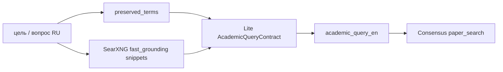
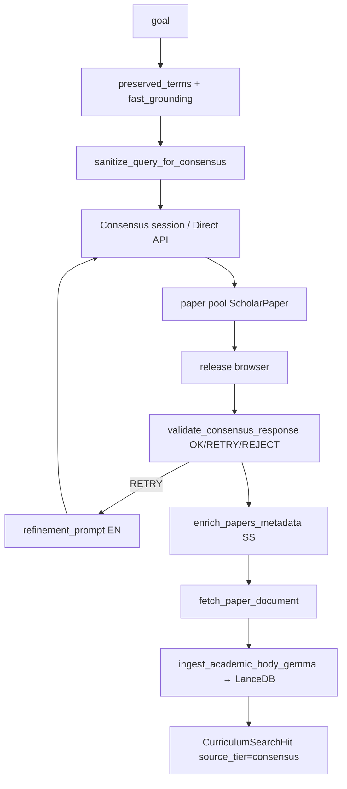

# Академический сбор и Consensus

Как из учебной цели получаются **papers** (не блоги): переформулирование запросов, Semantic Scholar / arXiv / SearXNG science, Consensus.app, ingest в LanceDB.

**Не путать** с практическим треком ([EXA_SEARCH.md](EXA_SEARCH.md)).  
**Две линии Consensus:** curriculum harvest (Skill Tree) и research-агент v0.8 ([V0_8_CONSENSUS_AGENT.md](V0_8_CONSENSUS_AGENT.md)). Общий prep запросов — один.

**См. также:** [SOURCE_POOL.md](SOURCE_POOL.md), [ARCHITECTURE_DEDUP.md](ARCHITECTURE_DEDUP.md), [CONSENSUS_API_DIRECT.md](CONSENSUS_API_DIRECT.md).

---

## 1. Переформулирование запросов (три архитектора)

Русская цель курса / ноды **не** уходит в SS/arXiv/Consensus as-is. Lite строит английский literature query.

| Архитектор | Контракт | Выход | Куда |
|------------|----------|-------|------|
| **Academic Query Architect** | `LiteAcademicQueryContract` | `academic_query_en` + `arxiv_params` (`ti:` / `abs:` / categories / годы) | SS, arXiv Atom, SearXNG science |
| **Consensus sanitizer** | `AcademicQueryContract` | `academic_query_en` (1–2 предложения) | Consensus.app / Direct API |
| **Practical Query Architect** | Exa 6 векторов | EN/RU engineering queries | [EXA_SEARCH.md](EXA_SEARCH.md) — не academic |

Academic Architect (`lite_search_pipeline.build_academic_search_plan`): конкретные CS-термины; запрет однословных generic (`python`); fallback — heuristic keywords + `heuristic_arxiv_params_from_keywords`.

### Consensus sanitize (обязательный prep)

Код: `consensus_query_prep.py` + `validator.sanitize_query_for_consensus`.

| Инвариант | Правило |
|-----------|---------|
| **preserved_terms** | Акронимы (RPG, LLM, RAG, lore, …) **verbatim** в EN-запросе — не синонимизировать |
| **WEB SNIPPETS** | Фразы из SearXNG grounding; не выдумывать trendy synonyms |
| **Убрать** | Личное железо, Docker/cloud product names, имена проектов |
| **Anchor sanitize** | Только user query — **без** Light RAG в anchor |
| **Relevance gate** | `ProfileApplicabilityContract`: профиль в validator только если вопрос про *их* стек |

Refinement (RETRY): `sanitize_message_for_consensus` / `RefinementSanitizeContract` — follow-up на ту же тему.

Тот же sanitizer для **лекции Stage 2**: `lecture_search_orchestrator.translate_to_en_query` (RU → EN перед SS/Consensus).

---

## 2. Curriculum: научная ветка DEEP-ноды

Точка: `targeted_node_search._academic_hits_for_node` → `fetch_academic_sources_async`.  
Policy: Consensus только при `hybrid` \| `academic_only` (`consensus_allowed_for_policy`). Флаг: `CURRICULUM_USE_V08_CONSENSUS`.

### Когда Consensus обязателен vs fallback

| Условие | Reason в логе |
|---------|----------------|
| Нода SotA / R&D (`layer=sota` или маркеры paper/arxiv/benchmark/…) | `sota_required` — harvest **до** или вместе с SS |
| Не SotA, но мало hits после primary | `academic_fallback` |
| Bulk academic без ноды и пустой пул | `academic_fallback (bulk)` |
| `practical_only` | Consensus **выкл** |

On-demand: сначала reuse LanceDB/registry + Lite eval; live Consensus только если approved reuse < порога.

### Primary papers (без Consensus)

`_primary_academic_hits`: **Semantic Scholar** → hydrate PDF/meta → hybrid rerank → **SearXNG science** (arxiv + Google Scholar, **не** bing/google) → **arXiv** с cascade relaxation, если пул тонкий.

Rerank (`academic_rerank.py`):

\[
\text{score} = \alpha\cdot\text{relevance} + \beta\cdot\text{trust} + \gamma\cdot\text{citations} + \delta\cdot\text{recency}
\]

Relaxation L0 strict → L1 soft date/citations → L2 broad; ослабляет `arxiv_params` (годы, cats).

Canonical URL: `academic_url_canonicalizer`. Dedupe papers: DOI / arXiv id / SS id.

---

## 3. Harvest статей через Consensus (`curriculum_v08_harvest`)

Один проход: sanitize → поиск → capture papers → **отпустить браузер** → Lite validate → enrich SS metadata → fetch bodies → Gemma ingest → `CurriculumSearchHit`.

**Validator** (`ValidationResultContract`): OK / RETRY (architectural gap, constraint mismatch **только если профиль непустой**, low diversity) / REJECT.  
RETRY шлёт `refinement_prompt` обратно в Consensus (`CONSENSUS_MAX_RETRIES`).

После capture Playwright не держится на Lite/PDF. Ingest: `academic_gemma_ingest` (summarizer), чанки в VectorStore. Skip Ollama, если уже есть TLDR/abstract достаточной длины.

Direct API vs DOM: [CONSENSUS_API_DIRECT.md](CONSENSUS_API_DIRECT.md) (`CONSENSUS_USE_DIRECT_API`, session JWT + `cf_clearance`). Логин: `./knowledge_engine/scripts/consensus-login.sh`.

---

## 4. Лекция: внешние verified sources (Stage 2)

`lecture_search_orchestrator`: Exa (практика) → если мало — **параллельно** Semantic Scholar + Consensus на **EN** query (тот же sanitizer). Блок `VERIFIED_EXTERNAL_SOURCES` для dense JSON (`used_sources` только из этого списка).

---

## 5. Research v0.8 (не Skill Tree)

Тот же sanitize + grounding + validator, затем chunking → L2a ConceptGraph → L2b ProfileGapMap → L2c TradeoffMatrix → Reasoner. UI `/app`. Канон: [V0_8_CONSENSUS_AGENT.md](V0_8_CONSENSUS_AGENT.md).

Skill Tree **не** зависит от `GRAPH_VERSION`; curriculum Consensus включается `CURRICULUM_USE_V08_CONSENSUS`.

---

## 6. Код

| Модуль | Роль |
|--------|------|
| `lite_search_pipeline.build_academic_search_plan` | Academic Query Architect |
| `consensus_query_prep.py` | preserved terms, payload, profile gate, sanitize anchor |
| `validator.py` | Lite sanitize / refinement / validate |
| `academic_source_fetch.py` | SS → SearXNG science → arXiv + Consensus policy |
| `academic_consensus.py` | SotA gate, `harvest_consensus_for_node` |
| `curriculum_v08_harvest.py` | Playwright/API harvest + ingest |
| `academic_searxng_search.py` | science engines only |
| `academic_rerank.py` | hybrid score + relaxation |
| `consensus_papers.py` / `paper_documents.py` | papers → URL/PDF |
| `academic_gemma_ingest.py` | body → LanceDB |
| `lecture_search_orchestrator.py` | Stage 2 waterfall |
| `fast_grounding.py` | SearXNG snippets для sanitizer |

Trace: `CURRICULUM academic query`, `CURRICULUM academic ▶`, `CURRICULUM consensus ▶`, `CURRICULUM v08`, `LECTURE_SEARCH`.
