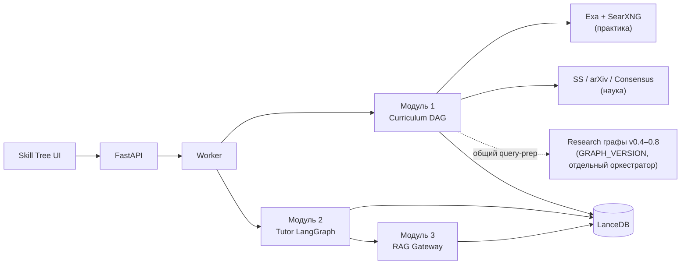
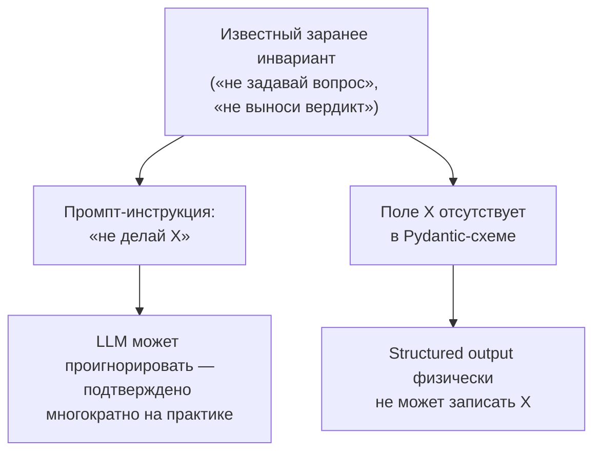
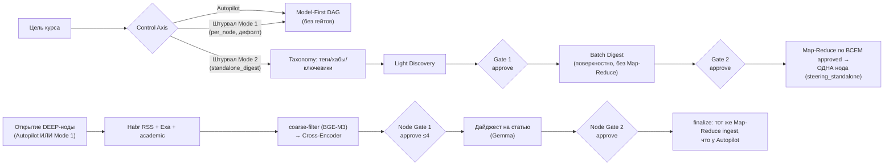
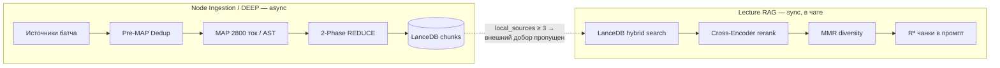
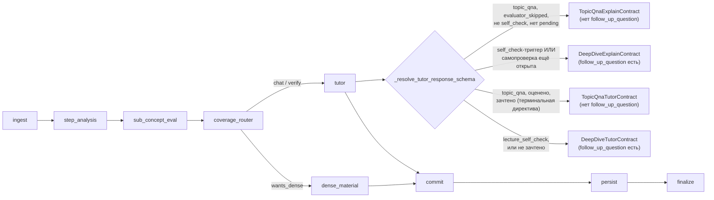

# Ключевые технические решения — карта «что и зачем»

Компактная карта самых основных архитектурных решений проекта: не «как
устроено» (это есть в модульных доках), а **зачем сделано именно так**.
Каждый пункт — 1–2 строки решения + причина + ссылка на подробности.

**Методология и честность источника.** Каждая строка помечена:

- ✅ — причина явно сформулирована в существующей документации (цитата/парафраз).
- 🟡 — причина частично объяснена или восстановлена из кода/докстрингов (канонического doc нет).
- ⚠️ — причина **не задокументирована нигде** — только констатация «что». Здесь дана моя собственная интерпретация (экономика/риск), явно помеченная как гипотеза, не факт.

Раздел [Пробелы](#пробелы-что-нужно-дописать-в-docs) внизу — прямой ответ на
вопрос «насколько это реализуемо только по имеющейся документации».

---

## Карта модулей

---

## Сквозные принципы

Эти три идеи повторяются в нескольких не связанных друг с другом местах
кода — они важнее любого отдельного модуля, потому что задают стиль решений
на будущее.

### 1. Инвариант — в схеме, а не в тексте промпта ✅

Если в момент запроса заранее известно, что модель **не должна** уметь
сделать что-то (задать вопрос, вынести вердикт), — это должно быть
физической невозможностью в Pydantic-схеме (`response_schema`), а не
текстовой просьбой в system prompt. Просьбу модель может проигнорировать;
отсутствующее поле — нет.

Два независимых применения одного и того же паттерна в проекте:

| Где                                                                                                              | Что скрыто                                                                                      | Источник                                                                                                                                                                                                                                   |
| ---------------------------------------------------------------------------------------------------------------- | ----------------------------------------------------------------------------------------------- | ------------------------------------------------------------------------------------------------------------------------------------------------------------------------------------------------------------------------------------------ |
| **Evaluator Bypass Guardrails** — `DeepDiveExplainContract` (host решил пропустить оценку)                       | Поля `audit`/вердикта нет вовсе — «модель физически не может обвинить пользователя в уклонении» | ✅ [PROMPT_SYSTEM_REFERENCE.md](PROMPT_SYSTEM_REFERENCE.md) §5, задокументировано изначально                                                                                                                                                |
| **Interaction Axis** — `TopicQnaLectureResponse`/`TopicQnaExplainContract`/`TopicQnaTutorContract` (`topic_qna`) | Поля `checkpoint_prompt`/`follow_up_question` нет — эксперт-консультант не может задать вопрос  | ✅ [STEERING_AND_TOPIC_QNA_ROADMAP.md](STEERING_AND_TOPIC_QNA_ROADMAP.md), обнаружено заново на практике: до этого пробовали текстовую инструкцию (промпт → потом `Field(description=…)`) — оба раза модель её игнорировала на живых тестах |

### 2. Никакого regex/substring для определения интента — только точный тег или векторный каталог ✅

Явно закреплено в docstring `IntentRule` (`intent_definitions.py`):
`cues`/`reference_phrases` — это только материал для offline-обучения
векторного каталога, **не** прод-путь. В проде интент определяется (а)
точным `[mode:]`/`[action:]` тегом/chip-лейблом, (б) векторным сходством
BGE-M3 по каталогу в LanceDB (порог ≈0.82) — никогда substring-поиском по
сырому тексту пользователя.

Важно: деградированный fallback (`resilience_manager.classify_intent_from_rules`,
когда векторный роутер недоступен) **не ослабляет** это правило — он
теряет нечёткое/семантическое сопоставление, но не скатывается в
substring-эвристики. Отсюда следствие: интенты без `exact_labels`
(например `clarify` — «переформулируй вопрос») недостижимы в
деградированном режиме — только через живой векторный роутер.

🟡 *Источник — код (*`intent_definitions.py`*,* `resilience_manager.py`*), не doc-файл; см. [Пробелы](#пробелы-что-нужно-дописать-в-docs).*

### 3. Изолированный промпт/схема на режим — не общий промпт с ветвлением 🟡

Каждый chip/режим (`[mode:gloss|how|mech|self_check|…]`) получает **свой**
system prompt (`prompt_factory.py`), а не условную вставку внутри одного
большого. Явное обоснование нашлось только для одного следствия этого
принципа — порядок JSON-полей в изолированных промптах (`summary=""`,
`references=[]`) специально ставится так, чтобы модель не тратила бюджет
токенов на невидимые UI-поля до начала стрима видимого текста
([PROMPT_SYSTEM_REFERENCE.md](PROMPT_SYSTEM_REFERENCE.md) §6, чек-лист п.2).

Наглядное **контрдоказательство от противного** — сама Interaction Axis
saga: до схемного фикса на общий dense-промпт лекции независимо
накладывались **шесть** отдельно сформулированных MANDATORY-фрагментов
про обязательный контрольный вопрос — ни один override в конце промпта не
мог надёжно перекрыть все шесть сразу. Изолированный промпт (свой, не
унаследованный от общего) не даёт такому конфликту физически возникнуть.

### 4. Add-only: новое поверх старого, старое не трогается ✅

Самое явное, буквально сформулированное как правило (не выведенное задним
числом) — открывает roadmap-документ: «не переписываем и не модифицируем
действующий рабочий код — Autopilot-пайплайны, текущие DDL, существующие
эндпоинты. Всё новое внедряется строго параллельно (add-only) — новыми
модулями, Pydantic-схемами, независимыми промптами, изолированными
эндпоинтами». Практическое следствие видно на каждом шаге Штурвала и Node
Grounding Gate: `WorkJobStatus.AWAITING_GATE_1`/`AWAITING_GATE_2` —
**новые** значения enum, а не переиспользование существующих;
`targeted_node_search.py`/`engine.py` при постройке Node Grounding Gate
вообще не изменены (только прочитаны, чтобы понять точку интеграции) —
корректность обеспечена конструкцией (`grounded`+`source_ref`
выставляются ДО того, как штатный `_apply_lazy_grounding_for_init`
вообще решит искать); `select_interaction_axis_system_prompt()`/
`resolve_topic_qna_entry()` (Topic Q&A, Этап 4) — добавлены, но
сознательно НЕ вызываются из горячего пути `coverage_router_node`/
`_invoke_tutor`, пока пользователь явно не подтвердил живую сшивку.

✅ [STEERING_AND_TOPIC_QNA_ROADMAP.md](STEERING_AND_TOPIC_QNA_ROADMAP.md), «Правило реализации (действует для всех этапов)».

---

## Модуль 1 — Curriculum

| Решение                                                                                         | Зачем                                                                                                                                                                                                                              |                                                        |
| ----------------------------------------------------------------------------------------------- | ---------------------------------------------------------------------------------------------------------------------------------------------------------------------------------------------------------------------------------- | ------------------------------------------------------ |
| Model-First DAG → risk classification (BASE/DEEP) → веб-поиск только для DEEP                   | ⚠️ Явно не объяснено; читается как экономия поиска/ingest на нодах, которые модель и так знает — это гипотеза, не цитата                                                                                                           | [CURRICULUM_MODULE_1.md](CURRICULUM_MODULE_1.md)       |
| Практика (Exa/SearXNG) и наука (SS/arXiv/Consensus) — два разных контура, не один               | 🟡 Задокументировано, что это разный ТИП контента (papers vs блоги) с разным ranking/постобработкой; прямого «почему нельзя одним» нет                                                                                             | [ACADEMIC_AND_CONSENSUS.md](ACADEMIC_AND_CONSENSUS.md) |
| Переформулирование запроса под каждый канал (RU цель ноды никогда не уходит as-is)              | ✅ Явно: Consensus обязан сохранять `preserved_terms` verbatim (иначе LLM-перефраз ломает точность академического поиска); anchor для Consensus — только вопрос пользователя, без Light RAG, чтобы не тащить нерелевантный контекст | [ACADEMIC_AND_CONSENSUS.md](ACADEMIC_AND_CONSENSUS.md) |
| Consensus: короткий Playwright только за токеном (`cf_clearance`/Clerk JWT), дальше `curl_cffi` | ✅ Замеры: DOM-путь ~14s+ vs warm API ~2s — операционное, не архитектурное решение                                                                                                                                                  | [CONSENSUS_API_DIRECT.md](CONSENSUS_API_DIRECT.md)     |
| `source_policy` (hybrid / practical_only / academic_only) — ручной переключатель контуров       | ⚠️ Не объяснено, зачем ручной выбор вместо одного универсального                                                                                                                                                                   | [SOURCE_POOL.md](SOURCE_POOL.md)                       |
| Research-графы (v0.4–0.8) отделены от Skill Tree curriculum (`GRAPH_VERSION`)                   | 🟡 Общее — один query-prep; явного «зачем разделять оркестраторы» нет, но у младшего слоя той же идеи (Search Horizons: SOTA/Infra/Prod) причина явная — не путать источники разных временных горизонтов в одном запросе           | [SEARCH_HORIZONS.md](SEARCH_HORIZONS.md)               |
| Control Axis: Autopilot vs Штурвал, **Mode 1** (`per_node`, дефолт Штурвала) | ✅ Явно: курс строится РОВНО как у Autopilot (Model-First DAG) — никакого Gate 1/2 на уровне курса нет вообще; заземление DEEP-нод — тот же универсальный Node Grounding Gate, что и у Autopilot (он не завязан на `control_axis`). ⚠️ Практическая разница с чистым Autopilot этим не объясняется явно — оба пути ведут себя идентично, кроме входного эндпоинта | [STEERING_AND_TOPIC_QNA_ROADMAP.md](STEERING_AND_TOPIC_QNA_ROADMAP.md) |
| Control Axis: Штурвал, **Mode 2** (`standalone_digest`) — фактический 2-gate HITL сценарий | ✅ Явно: это НЕ способ построить многоузловой курс — это способ получить ОДНУ глубоко проработанную ноду (1–12 подтем) из статей, которые пользователь лично отобрал на двух шагах одобрения (Taxonomy/Discovery → Gate 1 → Batch Digest → Gate 2), затем реальный Map-Reduce по ВСЕМ approved-статьям сразу | [STEERING_AND_TOPIC_QNA_ROADMAP.md](STEERING_AND_TOPIC_QNA_ROADMAP.md) |
| Mode 2 прошёл 3 итерации: текстовый документ → граф из ≥3 узлов-бакетов → одна нода | ✅ Явно на каждом шаге: v1 (`TopicDigestDocument`, без графа) — пользователь дважды уточнил, что ожидал полноценную загружаемую ноду, не документ; v2 (≥3 узла) — искусственное деление ТОЛЬКО ради схемного инварианта `CurriculumGraph.nodes>=3`; v3 (текущая) — инвариант снят условным `@model_validator` под новый `node_kind="steering_standalone"` (Autopilot не тронут), нарезка на бакеты убрана как искусственная | [STEERING_AND_TOPIC_QNA_ROADMAP.md](STEERING_AND_TOPIC_QNA_ROADMAP.md) |
| Node Grounding Gate — отдельный, более лёгкий per-node гейт, не часть Штурвала | ✅ Явно: чинит конкретный баг — у per-node lazy-grounding был SOTA-override, дающий неконтролируемый Consensus/arXiv/S2 харвест даже под `practical_only`; решение — новый изолированный сервисный слой, `targeted_node_search.py`/`engine.py` не трогаются вовсе (см. принцип 4, add-only) | [STEERING_AND_TOPIC_QNA_ROADMAP.md](STEERING_AND_TOPIC_QNA_ROADMAP.md) |
| Habr — genuine RSS-обнаружение по company hubs, не Exa-поиск с доменным ограничением | ✅ Явно и с датой: первая версия (Exa+domain=habr.com) не соответствовала заданию — переписано на `_fetch_habr_company_rss_items()`, URL-паттерн подтверждён живым `curl`, не угадан; фильтр по ключевикам на title/description **до** дорогого полнотекстового fetch (RSS даёт хронологию, не релевантность) | [STEERING_AND_TOPIC_QNA_ROADMAP.md](STEERING_AND_TOPIC_QNA_ROADMAP.md) |
| Node Grounding Gate переиспользует `harvest_consensus_for_node(..., defer_ingest=True)` вместо своего academic-сбора | ✅ Явно: избежать дублирования и риска повторного ~43-минутного харвеста тем же самым академическим механизмом, который уже есть в основном пайплайне | [STEERING_AND_TOPIC_QNA_ROADMAP.md](STEERING_AND_TOPIC_QNA_ROADMAP.md) |

## Модуль 3 — RAG

| Решение                                                                                                   | Зачем                                                                                                                                                                                           |                                                    |
| --------------------------------------------------------------------------------------------------------- | ----------------------------------------------------------------------------------------------------------------------------------------------------------------------------------------------- | -------------------------------------------------- |
| Directional RAG Gateway без единого LLM-вызова (только embed + Cross-Encoder)                             | 🟡 Не сформулировано явным предложением; вывод из архитектуры — брокер дёргается на каждый init/gap, LLM на каждый такой вызов = кост+латентность на самом частом пути                          | [RAG_GATEWAY_MODULE_3.md](RAG_GATEWAY_MODULE_3.md) |
| Два RAG-контура: Lecture (sync, чистая векторная математика) vs DEEP/Node Ingestion (async Map-Reduce)    | ✅ Явно: Map-Reduce = 4–8 отдельных Gemma-вызовов — недопустимо синхронно в чате; DEEP может себе это позволить (async, таймаут 600s)                                                            | [RAG_PIPELNES.md](RAG_PIPELNES.md)                 |
| MAP-окно фиксировано 2800 токенов, границы по AST                                                         | ✅ Явно: детерминизм TPM-бюджета + Prompt Caching для любой модели/провайдера; побочный эффект — функция не режется пополам                                                                      | [RAG_PIPELNES.md](RAG_PIPELNES.md)                 |
| Pre-MAP Dedup — до Map-Reduce, не после                                                                   | ✅ Явно: не тратить дорогой Map-Reduce на источник, который уже дубль другого в этом же батче. Код дедупится отдельно от текста — плоский AST не даёт Flash Lite сигнала для межъязыковых дублей | [ARCHITECTURE_DEDUP.md](ARCHITECTURE_DEDUP.md)     |
| Backfill margin вместо ALIAS-пометки near-duplicate                                                       | ✅ Явно: не сокращать итоговый набор источников — отбросить дубль и добрать из резерва, сохраняя полный/разнообразный набор                                                                      | [ARCHITECTURE_DEDUP.md](ARCHITECTURE_DEDUP.md)     |
| Два независимых citation-контура: `[R*]` chunk-level (LanceDB) vs `[S*]` document-level (SOURCE REGISTRY) | ⚠️ Не объяснено ни в одном из проверенных доков — разделение известно из практики этой сессии (`[Sn]`=Qdrant-паспорт документа, `[Rn]`=LanceDB-чанк), не из текста docs                         | —                                                  |
| Диаграммы — VLM классифицирует и генерирует Mermaid+caption, оригинальные изображения не хранятся         | ✅ Явно: дедуп по perceptual hash + SHA-256 для inline Mermaid, экономия хранилища                                                                                                               | [ARTICLE_DIAGRAMS.md](ARTICLE_DIAGRAMS.md)         |

## Модуль 2 — Tutor (LangGraph) + Interaction Axis

| Решение                                                                                                                                                                         | Зачем                                                                                                                                                                                                                                       |                                                                        |
| ------------------------------------------------------------------------------------------------------------------------------------------------------------------------------- | ------------------------------------------------------------------------------------------------------------------------------------------------------------------------------------------------------------------------------------------- | ---------------------------------------------------------------------- |
| Граф `ingest→step_analysis→sub_concept_eval→coverage_router→tutor|dense→commit→persist→finalize` + single-writer инвариант (LLM не пишет статусы карты)                         | 🟡 В самом Module 2 doc — только правило, без прозы-обоснования; тот же принцип владения явно обоснован в Evaluator Bypass Guardrails (см. принцип 1 выше)                                                                                  | [NODE_DEEP_DIVE_MODULE_2.md](NODE_DEEP_DIVE_MODULE_2.md)               |
| Двухшаговый intent routing: сначала дешёвый regex-разбор `[mode:]`-тега (0мс), потом дорогой векторный матч                                                                     | ✅ Явный порядок по стоимости — дешёвый путь раньше дорогого                                                                                                                                                                                 | [PROMPT_SYSTEM_REFERENCE.md](PROMPT_SYSTEM_REFERENCE.md) §2            |
| `ChatSessionManager`: смена `interaction_axis` для того же chat label — новая сессия (Summary handoff), как и смена модели                                                      | ✅ Обнаружено на практике: старая сессия реплеила чужой-осевой `api_turns` как history — модель имитировала свой же прошлый паттерн вопреки текущей инструкции                                                                               | [STEERING_AND_TOPIC_QNA_ROADMAP.md](STEERING_AND_TOPIC_QNA_ROADMAP.md) |
| Self-check в Topic Q&A: вопрос допустим только (а) на самом ходе `[mode:self_check]`, (б) пока pending открыт, (в) если ответ не зачтён (`last_eval_directive` не терминальный) | ✅ Обнаружено и зафиксировано именно в этой сессии — узкая, но принципиальная логика: «вопрос запрещён» и «вопрос обязателен пока цикл не закрыт» — не взаимоисключающие правила, а последовательность состояний одного и того же self-check | [STEERING_AND_TOPIC_QNA_ROADMAP.md](STEERING_AND_TOPIC_QNA_ROADMAP.md) |
| Star Task FSM (L4/L5–L6) — отдельный overlay поверх основного графа                                                                                                             | ⚠️ Не объяснено; уровни намекают на Bloom-таксономию (усложнение поверх базового прохождения), но это не прописано в коде                                                                                                                   | —                                                                      |

---

## Пробелы: что нужно дописать в docs

Прямой ответ на «насколько реализуемо только по имеющейся документации»:
**частично**. Явное, задокументированное «зачем» нашлось примерно для
половины пунктов выше (все ✅). Остальные — либо восстановлены из кода/
docstring'ов (🟡, без канонического doc-файла), либо не объяснены нигде
и помечены как моя гипотеза (⚠️). Если нужна полная самодостаточность
без пометок-гипотез, ниже — что стоит дописать первым, по убыванию
значимости:

1. **Почему Model-First DAG ищет только для DEEP-нод** (CURRICULUM_MODULE_1.md) — самое заметное отсутствие обоснования при том, что это едва ли не главное архитектурное решение Модуля 1.
2. **Почему** `[R*]`**/*`*[S*]` **— два разных citation-контура, а не один** — нигде не объяснено; ближайший кандидат для новой заметки в [LLM_CONTRACTS.md](LLM_CONTRACTS.md) или [RAG_PIPELNES.md](RAG_PIPELNES.md).
3. **Single-writer инвариант тьютора (concept_map) — почему именно так** — принцип есть в другом месте (Evaluator Bypass), но в [NODE_DEEP_DIVE_MODULE_2.md](NODE_DEEP_DIVE_MODULE_2.md) не сослались на него явно.
4. **Host-слой в целом** — это уже известный, самим `docs/INDEX.md` зафиксированный пробел (chips/vector router/prompt factory/Star Task FSM/Socratic poles — «реализовано в коде, нет канонического docs»); данный файл не заменяет тот будущий хост-док, только даёт минимальный срез «зачем» по имеющимся docstring'ам.
5. `source_policy` **и Star Task FSM** — оба без обоснования выбора вообще, только описание поведения.

## См. также

[INDEX.md](INDEX.md) — полный каталог документации и таблица «код ↔ docs».