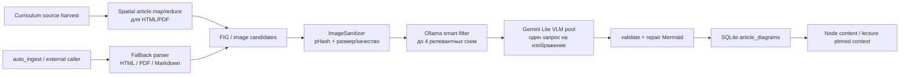

# Диаграммы из источников: ingestion → VLM → Tutor

Контур извлекает технические схемы из материалов curriculum и показывает их в содержимом ноды/лекции. Это не OCR и не хранилище оригинальных картинок: в БД сохраняются Mermaid, подпись и краткое описание, созданные VLM.

## Когда запускается

Для practical/blog-источника `source_material_pipeline` запускает spatial ingestion во время material harvest. Для HTML/PDF он сначала выделяет осмысленные участки статьи, затем передаёт FIG-изображения в общий VLM-пул. `auto_ingest` — самостоятельная reusable-точка входа: она пытается spatial-путь, а при его ошибке использует общий `ArticleIngestionPipeline` для HTML/PDF/Markdown.

Повторный harvest безопасен:

- стабильный `article_id` образуется из `source_id` и нормализованного URL;
- изображение дедуплицируется глобально по perceptual hash;
- один и тот же URL из разных source registry записей также находится по нормализованному URL;
- inline Mermaid в Markdown сохраняется без VLM и дедуплицируется по SHA-256 кода.

Академические источники не обязаны проходить этот контур: он ориентирован на извлечение диаграмм из доступного тела статьи, а не на генерацию схем для каждой ноды.

## Поток данных

VLM классифицирует картинку как `architecture`, `benchmark_chart` или `none`. Архитектурные схемы конвертируются в flowchart/sequence/class Mermaid; benchmark-графики — только в `xychart-beta`. Невалидный Mermaid, UI-скриншоты, дубликаты и ошибочно распознанные benchmark-flowchart отбрасываются.

## Хранилище и потребление

По умолчанию используется SQLite-файл `knowledge_engine/.runs/article_diagrams.db`; для внешней БД задайте `DATABASE_URL`. Таблица `article_diagrams` содержит:

| Поле | Назначение |
|---|---|
| `article_id` | связь с URL/source registry |
| `image_phash` | глобальный ключ дедупликации |
| `caption`, `summary` | контекст для интерфейса и тьютора |
| `mermaid_code` | сохранённая схема |

При init/chat ноды `article_diagram_context` находит схемы для `source_ref`, `mapped_source_ids` и `resource_urls`. `content_assets.hydrate_content_diagrams_from_articles` добавляет их в `content.diagrams`, не дублируя уже имеющийся Mermaid. Тьютор/лектор не генерируют Mermaid: выбирают `referenced_diagram_id` из DIAGRAM_CATALOG; сервер подставляет готовый код в `content.diagram`. В тексте — только ссылки `[Diagram N]` / `[diagram:diagram-N]`.

Диаграмма — вспомогательный материал, а не источник истины: текстовые ссылки и registry источников остаются каноническими.

## Конфигурация

Нужны обычные настройки Ollama, `GEMINI_API_KEY` и зависимости из `requirements.txt` (`Pillow`, `imagehash`, `PyMuPDF`, `SQLAlchemy`).

| Variable | Default | Роль |
|---|---|---|
| `DATABASE_URL` | SQLite в `.runs/article_diagrams.db` | расположение таблицы |
| `ARTICLE_DIAGRAM_FILTER_OLLAMA_MODEL` | `MAIN_MODEL` | предварительный отбор изображений |
| `ARTICLE_MAX_DIAGRAMS_PER_ARTICLE` | `4` | максимум кандидатов после фильтра |
| `BLOG_SPATIAL_*` | см. `.env.example` | triage и map/reduce статьи |
| `VLM_GEMINI_MODEL` | `gemini-3.5-flash-lite` | базовая мультимодальная модель |
| `VLM_GEMINI_MODELS` | model + Lite fallback chain | пул моделей для round-robin/failover |
| `VLM_GEMINI_MAX_RPM/TPM/RPD` | `14` / `250000` / `490` | shared Flash Lite caps (`GEMINI_FLASH_LITE_MAX_*`) for VLM **and** all other Lite roles |
| `VLM_GEMINI_CONCURRENCY` | `3` | параллельные запросы VLM |
| `VLM_GEMINI_QUOTA_TRACK` | `true` | исключать исчерпавшие квоту модели |

`VLM_GEMINI_*` перечитываются из `.env` при создании VLM-пула, поэтому изменение этих лимитов не требует перезапуска worker. Практический параллелизм spatial map также требует `OLLAMA_NUM_PARALLEL >= BLOG_SPATIAL_MAP_CONCURRENCY`.

## Диагностика

В trace ищите:

| Маркер | Значение |
|---|---|
| `ARTICLE_AUTO_INGEST` | старт/fallback авто-ingest |
| `BLOG_SPATIAL pool` | batch spatial map/reduce |
| `ARTICLE_SMART_FILTER` | сколько изображений прошло фильтр |
| `VLM pool` / `VLM slot` | модель, лимиты и квота |
| `ARTICLE_INGEST ✓` | число сохранённых схем |
| `NODE_DIVE hydrate diagrams ✓` | схемы добавлены к контенту ноды |

Пустой результат допустим: статья может не содержать пригодной схемы, все изображения могут оказаться не-диаграммами или VLM может быть временно недоступен. Ошибка ingestion не должна прерывать генерацию curriculum: вызывающий код ловит её и продолжает harvest.

## Карта кода

| Задача | Код |
|---|---|
| Автозапуск | `src/curriculum/source_material_pipeline.py`, `services/article_ingestion/auto_ingest.py` |
| Парсеры и отбор | `services/parsers/`, `article_ingestion/smart_filter.py` |
| Spatial processing | `article_ingestion/blog_spatial_pipeline.py` |
| VLM pool | `services/vlm_batcher.py`, `services/vlm_gemini_pool.py` |
| SQLite CRUD | `models/article_diagrams.py`, `services/article_diagram_store.py` |
| Привязка к ноде/лекции | `services/article_diagram_context.py`, `src/node_deep_dive/content_assets.py` |
