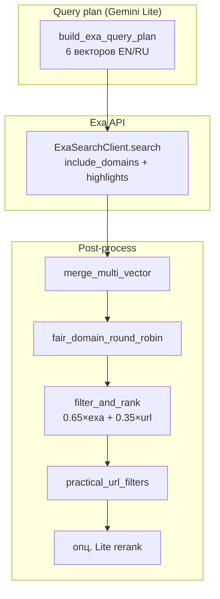

# Exa Search — архитектура и конфигурация

Нейронный поиск по whitelist-доменам через [exa-py](https://docs.exa.ai/).  
Код: `services/search/exa_client.py`, `exa_transform.py`, `exa_domains.py`.  
Whitelist: `src/source_evaluator/whitelist.py` (`APPROVED_SOURCES_WHITELIST`).

**См. также:** [SOURCE_POOL.md](SOURCE_POOL.md), [TUTOR_PIPELINES.md](TUTOR_PIPELINES.md), [ENV_VARIABLES.md](ENV_VARIABLES.md).

---

## 1. Обзор архитектуры

### Multi-Vector Query Plan (`build_exa_query_plan`)

Lite строит до **6** поисковых векторов (`ExaQuerySpec`: `role`, `query`, `highlight_query`). Цель — покрыть архитектуру, internals, failure modes и русские лонгриды, **не** API/SDK reference.

| Role | Язык | Назначение |
|------|------|------------|
| `en_declarative` | EN | Обзорный engineering narrative / system design |
| `en_technical` | EN | Internals, алгоритмы, реализация |
| `en_edge_cases` | EN | Failure modes, bottlenecks, инциденты |
| `ru_short` | RU | Короткий инженерный запрос |
| `ru_expert_article` | RU | Экспертный разбор в стиле Хабра |
| `ru_practical_cases` | RU | Продакшен-кейсы, постмортемы, оптимизация |

Каждому role сопоставлен свой `highlight_query` (`_EXA_HIGHLIGHT_BY_ROLE`) — подсказка Exa, какие предложения вытягивать в highlights (архитектура / trade-offs, не списки параметров API).

**Инварианты плана**

- Минимум один RU-вектор (fallback на `ru_expert_article`, если Lite не заполнил RU).
- При ошибке Lite → fallback `build_exa_dual_queries` (пара EN/RU).
- Параллельные поиски: семафор `EXA_MAX_CONCURRENT_SEARCH`.

### Контуры вызова

| Контур | Точка входа | Поведение |
|--------|-------------|-----------|
| **DEEP Targeted** | `targeted_node_search` → `fetch_exa_curriculum_hits_for_node` | Полный multi-vector plan → merge → recall RR → URL rank → practical filter → Lite rerank при `len > EXA_RERANK_LITE_THRESHOLD`; затем SearXNG добирает |
| **Bulk Practical** | `practical_source_fetch` → `fetch_exa_curriculum_hits_simple` | Один query, без dual/multi-vector; domain cap через `apply_exa_domain_cap` |
| **Lecture Stage 2** | `lecture_search_orchestrator` → `ExaSearchClient` + `postprocess_exa_hits_for_external_recall` | Внешние verified sources для dense; composite rank + practical filter |
| **Provider Registry** | `ExaSearchProvider` в `SearchRegistry` (`resolved_search_active_providers`) | Общий async provider `name=exa`; в начало списка при `EXA_API_KEY` + `EXA_SEARCH_ENABLED` |

Условие включения: `EXA_API_KEY` непустой и `EXA_SEARCH_ENABLED=true`.

---

## 2. Пайплайн обработки и ранжирования

### Составной скоринг

После сбора hits:

\[
\text{rank} = 0.65 \times \mathrm{norm}(\texttt{exa\_score}) + 0.35 \times \mathrm{norm}(\texttt{url\_heuristic})
\]

| Компонент | Нормализация |
|-----------|--------------|
| `exa_score` | Exa relevance ∈ [0, 1]; `None` → 0.5 |
| `url_heuristic` | целое ~−10…+10 → `[0, 1]` как `(clamp(s) + 10) / 20` |

**URL heuristic** (`_exa_url_quality_score`):

| Сигнал | Δ |
|--------|---|
| Статья: `/blog/`, `/posts/`, `/guides/`, `/engineering/`, … | **+2** за маркер |
| Docs/API: `/docs/`, `/api/`, `/swagger/`, `/openapi/`, `/sdk/`, … | **−5** за маркер |
| Путь оканчивается на `/docs` или `/reference` | **−4** |
| `readme.io` / `readthedocs` | **−4** |

Отсев по URL quality: hits с `url_heuristic ≤ -5` отбрасываются (если после фильтра пусто — оставляют исходный пул). Затем сортировка по убыванию composite score (`filter_and_rank_exa_curriculum_hits`).

### Practical filters (`practical_url_filters`)

Поверх rank — `filter_practical_search_row` / `practical_url_reject_reason`:

- path-маркеры swagger/openapi/api/docs/sdk → reject;
- blocked hosts: arXiv, DOI, Semantic Scholar, Wikipedia, словари, …;
- только `http(s)`.

Дополнительно на DEEP-пути: `is_collectible_article_url` (homepage gate и т.п.).

### Диверсификация `fair_domain_round_robin`

Round-robin по host: сначала 1-я статья с каждого домена, затем 2-я и т.д., пока не заполнен `cap`.

| Env | Роль в RR |
|-----|-----------|
| `EXA_RECALL_MAX_PER_DOMAIN` | **DEEP** recall / финальный RR / Lite-rerank diversify (`max_per_domain`) |
| `EXA_FAIR_ROUND_ROBIN_MAX_PER_DOMAIN` | Дефолт `fair_domain_round_robin`, если `max_per_domain` не передан; также `apply_exa_domain_cap` (bulk/simple) |

Инвариант: `max_per_domain ≥ 1`. URL dedupe внутри RR.

### Lite rerank (DEEP)

Если после фильтров кандидатов **больше** `EXA_RERANK_LITE_THRESHOLD` → `batch_lite_eval_curriculum_hits` (strict) → снова `fair_domain_round_robin` с `EXA_RECALL_MAX_PER_DOMAIN`. Иначе — только RR до `cap`.

### Highlights

`ExaSearchClient` запрашивает **только highlights** (без платного Exa AI summary). Query highlights = per-vector `highlight_query` или fallback `EXA_PRACTICAL_HIGHLIGHT_QUERY`. Достаточный объём highlights → `skip_ollama_summary` на hit.

---

## 3. Источники и домены (`exa_domains.py`)

### `APPROVED_SOURCES_WHITELIST`

Категории в `whitelist.py`:

| Категория | Примеры |
|-----------|---------|
| `practitioners` | eugeneyan.com, lilianweng.github.io, … |
| `ai_pioneers_labs` | openai/anthropic/deepmind research, **`habr.com/ru/companies/yandex`**, … |
| `engineering_blogs` | Cloudflare, Netflix, Uber, Stripe, … |
| `foundational_docs` | MDN, Python, AWS architecture, … |
| `community_blogs` | **`habr.com`**, vc.ru, avito.tech, selectel.ru |

### Очистка для Exa API

Функция: **`get_clean_exa_domains(whitelist_dict)`** (не путать с несуществующим `get_exa_include_domains`).  
Клиент: `ExaSearchClient.whitelist_include_domains()` → тот же список.

`clean_domain_for_exa`:

- срезает scheme / path / query → **host**;
- снимает `www.`;
- пример: `habr.com/ru/companies/yandex` → **`habr.com`**.

Exa `include_domains` принимает только хосты → path-записи whitelist **схлопываются** в уникальные домены. Полный path остаётся значимым для **evaluator** (substring match по паттерну whitelist).

### Корпоративные хабы на Хабре

В `ai_pioneers_labs` явно указан путь `habr.com/ru/companies/yandex` (и общий `habr.com` в `community_blogs`):

- для Exa recall — домен `habr.com` (вместе с остальными Habr-страницами);
- для Lite/evaluator APPROVED — path-паттерн усиливает доверие к company blogs;
- RU-векторы плана (`ru_expert_article`, `ru_practical_cases`) заточены под стиль Habr longread.

`exclude_domains` по умолчанию: `EXCLUDED_SOURCES_BLACKLIST` (medium, twitter, …).  
`exclude_text`: одна фраза ≤5 слов из `EXA_EXCLUDE_TEXT` (нормализация в `normalize_exa_exclude_text`).

---

## 4. Справочник Env (`EXA_*` и смежные)

Источник истины: `knowledge_engine/config.py`. Шаблон: `.env.example`.

| Variable | Default | Описание |
|----------|---------|----------|
| `EXA_API_KEY` | empty | Ключ Exa; без него поиск выключен |
| `EXA_SEARCH_ENABLED` | `true` | Глобальный выключатель (даже при ключе) |
| `CURRICULUM_PRACTICAL_EXA_LIMIT` | `12` | Верхняя граница `num_results` / cap simple+bulk |
| `EXA_FETCH_NUM_RESULTS` | `20` | Бюджет recall на DEEP (деление на число векторов; `fetch_cap`) |
| `EXA_MAX_CONCURRENT_SEARCH` | `3` | Параллельные Exa-запросы в multi-vector |
| `EXA_RECALL_MAX_PER_DOMAIN` | `2` | Max hits на host в DEEP RR / rerank diversify |
| `EXA_FAIR_ROUND_ROBIN_MAX_PER_DOMAIN` | `1` | Дефолт RR (`apply_exa_domain_cap`, simple path) |
| `EXA_DOMAIN_CAP_PER_HOST` | `1` | Объявлена в `config` / `.env.example`; **runtime cap** — через `EXA_RECALL_*` / `EXA_FAIR_*` |
| `EXA_RERANK_LITE_THRESHOLD` | `5` | Lite rerank, если кандидатов строго больше порога |
| `EXA_DUAL_QUERY_EN_RATIO` | `0.7` | Доля EN при merge dual-query (`merge_dual_exa_hits`, fallback path) |
| `EXA_EXCLUDE_TEXT` | `api reference documentation sdk classes` | Exa `excludeText` (≤5 слов после normalize) |
| `EXA_PRACTICAL_HIGHLIGHT_QUERY` | engineering deep-dive prompt (см. `config.py`) | Fallback highlight query |
| `EXCLUDED_SOURCES_BLACKLIST` | medium,dev.to,twitter,… | `exclude_domains` для Exa |

Связанные curriculum-лимиты (не `EXA_*`, но влияют на контур):

| Variable | Default | Связь с Exa |
|----------|---------|-------------|
| `CURRICULUM_DEEP_NODE_MAX_HITS` | `4` | `cap` Targeted practical (Exa + SearXNG) |
| `CURRICULUM_TARGETED_NODE_GROUNDING_ENABLED` | `true` | DEEP-контур с Exa |

`resolved_search_active_providers()` вставляет `"exa"` **первым**, если ключ и флаг включены.

---

## 5. Код и отладка

| Модуль | Роль |
|--------|------|
| `exa_client.py` | SDK wrapper, highlights, whitelist domains |
| `exa_domains.py` | `clean_domain_for_exa`, `get_clean_exa_domains` |
| `exa_transform.py` | Query plan, rank, RR, fetch DEEP/simple |
| `providers.py` | `ExaSearchProvider` |
| `practical_url_filters.py` | Post-filter practical |
| `whitelist.py` | `APPROVED_SOURCES_WHITELIST` |

Trace-маркеры: `CURRICULUM exa ▶/✓/✗`, `exa query_plan`, `fair_round_robin`, `exa lite rerank`, `LECTURE_EXA`.

Тесты: `tests/services/search/test_exa_transform.py`.
