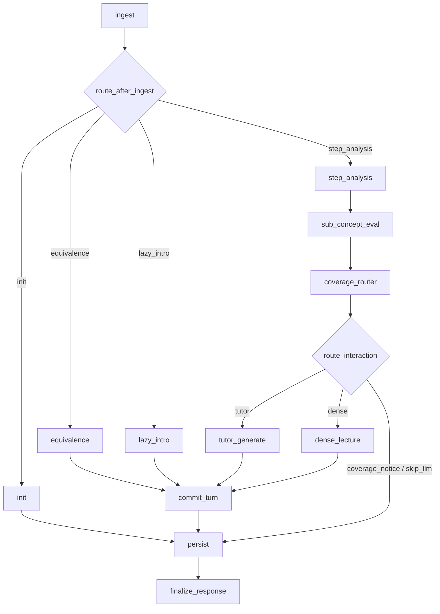
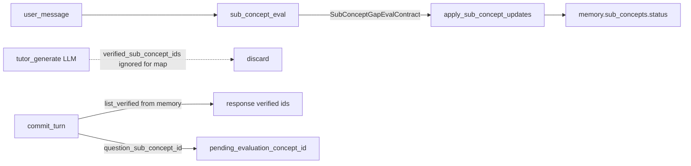

# Модуль 2 — Node Deep-Dive Engine

Интерактивное погружение в ноду учебного графа (Модуль 1): tiered memory, **LangGraph-оркестрация**, RAG Gateway → ритмичный учебный цикл.

**См. также:** [TUTOR_PIPELINES.md](TUTOR_PIPELINES.md) (§8), [TUTOR_PROMPT_AND_UI_TEXT.md](TUTOR_PROMPT_AND_UI_TEXT.md), [TUTOR_LANGGRAPH_MIGRATION.md](TUTOR_LANGGRAPH_MIGRATION.md), [LECTURE_RAG_CONTEXT.md](LECTURE_RAG_CONTEXT.md).

## Ритмичный учебный цикл (Learning Loop)

| Фаза | Что происходит |
|------|----------------|
| `intro_assessment` | Init / lazy intro: один экспресс-вопрос. |
| `dense_material` | Heavy: плотный материал, Mermaid, Rich Resource карточки. |
| `checkpoint` | Короткая самопроверка в чате. |
| `pathway_decision` | Выбор траектории / финализация (coverage complete). |
| `socratic_focus` | Точечный Сократ по запросу `[mode:socratic]`. |

**Модели:** `GEMINI_TUTOR_MODEL` — intro, chat, dense; `GEMINI_LITE_MODEL` — step_analysis, gap eval, fact manifest; `GEMINI_REASONER_MODEL` — curriculum (не chat-turn).

**Лекция (`dense_material`):** `retrieve_lecture_rag_context()` → CE rerank → MMR → top чанки + pinned whitelist. Подробности: [LECTURE_RAG_CONTEXT.md](LECTURE_RAG_CONTEXT.md).

**UI:** drawer mastery, режимы Лекция / Блиц / Сократ. Текст чата собирается из семантических полей контракта (см. [TUTOR_PROMPT_AND_UI_TEXT.md](TUTOR_PROMPT_AND_UI_TEXT.md)).

---

## Канонический DAG (LangGraph)

**Фасад:** `engine.run_node_deep_dive` → `get_compiled_tutor_graph().ainvoke(...)`.

**Граф:** `src/node_deep_dive/graph/` (`build_tutor_graph`, `TutorGraphState`).

**Поток (thread):** `configurable.thread_id = anchor` (`node_deep_dive:{curriculum_id}:{node_id}`).

**Checkpoint:** `MemorySaver` (in-process; не переживает рестарт процесса).

| Маршрут после `ingest` | Условие |
|------------------------|---------|
| `init` | `user_action=init` |
| `equivalence` | отказ от equivalence при `node_status=unexplored` |
| `lazy_intro` | первый chat на сессии без intro |
| `step_analysis` | обычный chat / verify |

| `route` после `coverage_router` | Следующая нода |
|--------------------------------|----------------|
| `tutor` (default) | `tutor_generate` |
| `dense` | `dense_lecture` |
| `coverage_notice` / `transition` / `skip_llm` | сразу `persist` |

Стриминг: `stream_callback` только через `config["configurable"]`, не через state.

---

## Single-Writer: coverage / `verified_sub_concept_ids`

| Правило | Инвариант |
|---------|-----------|
| **Тьютор LLM ≠ writer карты** | Поле `DeepDiveTutorContract.verified_sub_concept_ids` **не** мутирует `memory.sub_concepts` |
| **Единственный writer статусов** | `sub_concept_eval` → gap-eval (`SubConceptGapEvalContract`) → `apply_sub_concept_updates` (scope = pending id; ранг статусов; no silent downgrade `verified`) |
| **Commit** | `commit_turn` выставляет `pending_evaluation_concept_id` из `question_sub_concept_id`; API `verified_sub_concept_ids` = `list_verified_sub_concept_ids(memory)` |
| **Router без LLM** | `coverage_router` выбирает `focus_sub_concept_id` / `route` / `interaction_mode` детерминированно |

---

## Таблица ответственности узлов

Путь: `knowledge_engine/src/node_deep_dive/graph/nodes/` (+ `subgraphs/init.py`).

Состояние: `TutorGraphState` (`graph/state.py`). Персистентное ядро — только `memory: SessionMemory`.

| Нода | Файл | Роль | Ключи state, которые пишет |
|------|------|------|----------------------------|
| `ingest` | `ingest.py` | Валидация, load session/content | `memory`, `anchor`, `content`, `rag_*` |
| `init` | `subgraphs/init.py` | Prepare init (RAG grounding) | `memory`, `content`, `rag_*` → далее `persist` |
| `lazy_intro` | `lazy_intro.py` | Первый intro / fast-track | `memory`, `tutor_message`, `llm_out` → `commit_turn` |
| `equivalence` | `equivalence.py` | Отказ «уже знаю» | `memory`, `tutor_message`, `llm_out` → `commit_turn` |
| `step_analysis` | `step_analysis.py` | Lite intent + `concepts_matrix` | `memory`, `intent`, `pipeline_gap` |
| `sub_concept_eval` | `sub_concept_eval.py` | Gap eval → статусы карты | `memory` (`sub_concepts`, pending clear) |
| `coverage_router` | `coverage_router.py` | Mode / dense vs tutor / focus | `interaction_mode`, `route`, `focus_sub_concept_id`, `intent`, `memory`, опц. `content`/`tutor_message` |
| `tutor_generate` | `tutor_generate.py` | Gemini dialogue / lecture_chat | `llm_out`, `tutor_message`, `memory.chat_sessions`, `content` |
| `dense_lecture` | `dense_lecture.py` | RAG + dense LLM | `content`, `memory`, `tutor_message`, `llm_out` |
| `commit_turn` | `commit_turn.py` | Окна, pending, orchestrate transition | `memory`, `tutor_message`, `llm_out`, `response_verified_sub_concept_ids` |
| `persist` | `persist.py` | Disk + UI history | `memory`, `session_history`, `tutor_message` |
| `finalize_response` | `finalize_response.py` | `NodeDeepDiveResponse` | `response` |

Условные рёбра: `graph/routing.py` (`route_after_ingest`, `route_interaction`).

---

## Tiered Memory (4 слоя в промпте тьютора)

1. **Compressed RAG Profile** — срез фактов Модуля 3; фиксируется на init.
2. **Core Concepts Matrix** — `core_concepts` / `concepts_matrix` (`status`, `evidence`, `mastery_score`).
3. **Fact manifest** — JSON на `SessionMemory`; пополняется при вытеснении окна (Lite).
4. **Active Dialogue Window** — последние 3 цикла в `memory.active_window`; native Gemini history на ходах ≥1.

Персистентность: `memory` в `node_deep_dive_sessions.json` (+ `memory.chat_sessions`); UI `history` для чата.

### Explicit Gemini Cache

Вкл.: `ENABLE_GEMINI_EXPLICIT_CACHE`. Менеджер: `services/gemini_cache_manager.py`.

| Слой | Сборка | При active cache |
|------|--------|------------------|
| Layer 1 — Static | `build_layer1_explicit_cache_context` | Explicit Cache + `system_instruction` |
| Layer 2 — Session | `build_layer2_session_state_context` (manifest, mastery, concept_map) | User payload при смене digest |
| Layer 3 — Hot | behavior state + `build_dynamic_suffix` (+ `api_turns`) | Каждый ход |

Режимы: `hit` / `created` / `skipped_below_threshold` / `disabled` / `error_fallback`. Трасса: `session_prompt_trace.py`.

Пространственная раскладка BLOCK 1–3 для dense/explain: [TUTOR_PROMPT_AND_UI_TEXT.md](TUTOR_PROMPT_AND_UI_TEXT.md).

## ChatSessionManager

- Сессии: `session_id` + `model_name` + label (intro / step_analysis / tutor / dense).
- Probe → fallback chain; смена модели → Summary handoff.
- Init → `clear_all`; dense → Fresh session.
- Код: `services/chat_session_manager.py`, `gemini_stateless.py`.

## API

| Action | Endpoint | Граф |
|--------|----------|------|
| `init` | `POST /node/init` | `ingest` → `init` → `persist` → `finalize` |
| `chat` / `verify` | `POST /node/chat`, `/verify` | полный chat-turn DAG |

Синхронно (вне worker graph): `POST /node/suggest-questions`, `POST /node/explain-selection-stream` (SSE).  
Контракты / explain: [LLM_CONTRACTS.md](LLM_CONTRACTS.md), [SKILL_TREE_UI.md](SKILL_TREE_UI.md).

Ответ: `NodeDeepDiveResponse` — `node_status`, составной `tutor_message` (из semantic fields), `content`, `history`, mastery / coverage, …

## Надёжность

- `step_analysis` / gap eval / manifest — Lite; при ошибке step — heuristic intent.
- Gemini 503/429: probe → retry + chain fallback.
- Redis: `REDIS_SOCKET_TIMEOUT_SEC`, retry job wait.

## Код

| Компонент | Путь |
|-----------|------|
| Фасад | `src/node_deep_dive/engine.py` (`run_node_deep_dive`) |
| LangGraph | `src/node_deep_dive/graph/` |
| Coverage domain | `concept_map.py`, `concept_map_state.py`, `sub_concept_evaluator.py` |
| Dense / lecture RAG | `services/node_content_generator.py`, [LECTURE_RAG_CONTEXT.md](LECTURE_RAG_CONTEXT.md) |
| Промпты / UI | [TUTOR_PROMPT_AND_UI_TEXT.md](TUTOR_PROMPT_AND_UI_TEXT.md) |
| Tiered memory | `tiered_memory.py`, `dialog_context.py`, `fact_manifest.py` |
| Step analysis | `step_pipeline.py` |
| Store | `session_store.py` → `.runs/node_deep_dive_sessions.json` |
