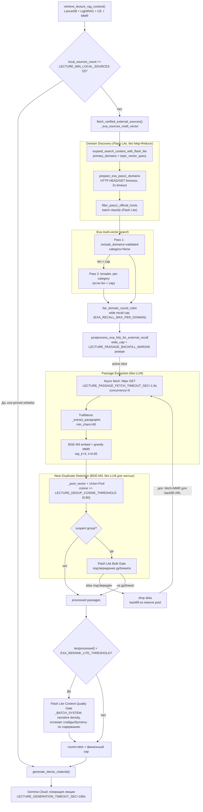
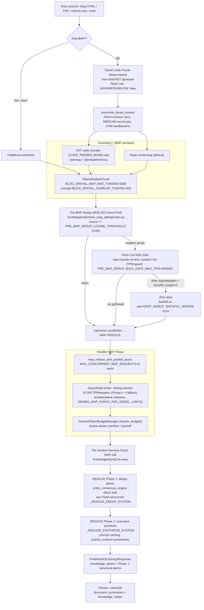
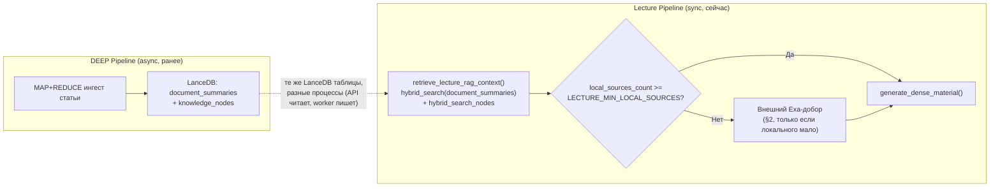

# RAG Pipelines: Lecture (Fast Track) vs DEEP/Node Ingestion (Map-Reduce Track)

Сводный документ по двум независимым контурам сбора и обработки внешнего
материала. Создан по Search-First аудиту: канонического сравнения этих двух
контуров бок о бок в `docs/` не было — детали были разнесены по
[EXA_SEARCH.md](EXA_SEARCH.md) (поиск/домены), [LECTURE_RAG_CONTEXT.md](LECTURE_RAG_CONTEXT.md)
(локальный RAG перед лекцией), [ARCHITECTURE_DEDUP.md](ARCHITECTURE_DEDUP.md)
(Pre-MAP Dedup) и [CODE_TRIAGE_AND_PRUNING.md](CODE_TRIAGE_AND_PRUNING.md)
(код перед MAP). Этот файл не дублирует их — ссылается и добавляет сравнение
+ Mermaid-схемы обоих контуров целиком, от запроса до персистентного
результата.

**См. также:** [EXA_SEARCH.md](EXA_SEARCH.md), [LECTURE_RAG_CONTEXT.md](LECTURE_RAG_CONTEXT.md),
[ARCHITECTURE_DEDUP.md](ARCHITECTURE_DEDUP.md), [CODE_TRIAGE_AND_PRUNING.md](CODE_TRIAGE_AND_PRUNING.md),
[NODE_DEEP_DIVE_MODULE_2.md](NODE_DEEP_DIVE_MODULE_2.md), [PERFORMANCE.md](PERFORMANCE.md).

---

## 1. Executive Overview

| Параметр | Lecture Pipeline | DEEP / Node Pipeline |
| :--- | :--- | :--- |
| **Режим вызова** | Synchronous (Online / UX-critical), внутри `POST /node/chat[-stream]` | Asynchronous (Offline / Background Worker, `WorkJobKind.NODE_DEEP_DIVE`) |
| **Target latency** | Design-бюджет ~30s на добор (нет единого enforced timeout; см. §2.4) | ~300–400s наблюдаемо на плотных статьях; hard ceiling `KE_NODE_DIVE_ASYNC_TIMEOUT_SEC=600s` |
| **Обработка контента** | Lightweight Passage Extraction: Trafilatura → BGE-M3 + greedy MMR, без LLM-прохода по документу | 2-Pass Map-Reduce: чанки ~2800 ток → parallel MAP (Gemma Cloud) → 2-Phase REDUCE |
| **Ограничения API** | Низкое TPM: только Flash Lite (Domain Discovery + Content Gate), без Gemma MAP | 16 000 TPM/модель (Primary + Fallback, независимые корзины) через sliding-window rate limiter + backoff |
| **Lifecycle** | Эфемерный — passages живут в рамках одного `generate_dense_material()` вызова, не персистятся отдельно | Персистентный — `FinalArticleSummaryResponse` → LanceDB (`document_summaries`, `knowledge_nodes`) |
| **Near-dup защита** | BGE-M3 Union-Find + Flash Lite Bulk Gate, **backfill** из резерва (`LECTURE_PASSAGE_BACKFILL_MARGIN`) | Тот же примитив (`pre_map_deduplicator.py`), **backfill** из резерва (`DEEP_INGEST_BACKFILL_MARGIN`) |
| **Точка входа** | `src/node_deep_dive/lecture_search_orchestrator.py::_exa_sources_multi_vector` | `src/curriculum/targeted_node_search.py::search_sources_for_deep_node_async` |

---

## 2. Lecture Pipeline (Dynamic / Fast Track)

### 2.1 Контекст: локальный RAG идёт первым

Внешний Exa-добор (эта секция) — **не** первый шаг лекции. Перед ним всегда
отрабатывает `retrieve_lecture_rag_context()` (LanceDB `document_summaries` +
`knowledge_nodes` hybrid + LightRAG → Cross-Encoder → MMR, подробно в
[LECTURE_RAG_CONTEXT.md](LECTURE_RAG_CONTEXT.md)). Если после него
`local_sources_count >= LECTURE_MIN_LOCAL_SOURCES` (default **3**) или есть
pinned whitelist — внешний Exa-добор **пропускается целиком**. Это и есть
основная точка пересечения с DEEP-контуром: `document_summaries` наполняется
именно DEEP MAP+REDUCE ингестом (§4).

### 2.2 Mermaid: внешний добор (когда локального RAG недостаточно)

### 2.3 Почему без Map-Reduce (обоснование ~30s UX-бюджета)

Map-Reduce = генеративный LLM-проход **по каждому документу** (MAP-окно →
Gemma) плюс 2-фазный REDUCE поверх результатов MAP — секции 3.2–3.3. Для
лекции, вызываемой синхронно внутри чата тьютора, это было бы 4–8 отдельных
Gemma-вызовов (по числу отобранных источников) **до** генерации самой лекции
— при 16 000 TPM бюджете DEEP-стороны (§3.4) это добавило бы десятки секунд
даже без throttling. Вместо этого вся фильтрация и отбор в Lecture Stage 2 —
**чистая векторная математика** (BGE-M3 эмбеддинги + greedy MMR + Union-Find),
без единого Gemma-вызова на документ:

- Единственные LLM-вызовы во всём внешнем доборе — Flash Lite (лёгкая модель,
  не Gemma Primary/Fallback): Domain Discovery (гипотезы доменов + authority
  classify) и, опционально, Content Quality Gate / Bulk Gate дубликатов —
  обе на **батч** кандидатов одним вызовом, не на документ.
- Reserve-margin backfill (`LECTURE_PASSAGE_BACKFILL_MARGIN=3`) выбирается из
  уже отфетченного пула — не требует нового Exa-запроса.

Явных проверенных таймаутов на весь контур внешнего добора как единого
целого в коде нет (это design-цель, не enforced budget); enforced бюджеты по
стадиям: `LECTURE_EXTERNAL_SEARCH_HTTP_TIMEOUT_SEC=25s` (на вектор/Discovery-
шаг), `LECTURE_PASSAGE_FETCH_TIMEOUT_SEC=1.8s` × concurrency=6 на фетч
партии URL, `LECTURE_GENERATION_TIMEOUT_SEC=180s` — уже сама генерация текста
лекции Gemma Cloud, вне этого добора.

### 2.4 Как BGE-M3 отсекает шум и зеркала доменов без LLM

Два независимых BGE-M3-контура работают **до** любого Gemma/Flash Lite вызова
по контенту:

1. **MMR-отбор абзацев** (`stage3_mmr_paragraphs_batch`, переиспользован из
   `pre_flight_triage.py`) — greedy Maximal Marginal Relevance: на каждом шаге
   берётся абзац, максимизирующий `λ·relevance(core_theme) − (1−λ)·max_sim(уже
   выбранным)`. При `λ=0.65` (`LECTURE_PASSAGE_MMR_LAMBDA`) отбор смещён к
   релевантности, но штрафует почти идентичные абзацы (например, два зеркала
   одной статьи выдали бы почти одинаковые top-абзацы — MMR такой повтор не
   пропустит во второй раз).
2. **Union-Find дедупликация целых источников** (`find_near_duplicate_urls`,
   переиспользует `_cluster_text_candidates`/`_pool_vector` из
   `src/deduplication/pre_map_deduplicator.py`) — пуловый вектор (усреднение
   MMR-абзацев) на источник, кластеризация по косинусу
   `≥ LECTURE_DEDUP_COSINE_THRESHOLD (0.80)`. Suspect-группы (≥2 источника в
   кластере) идут в Flash Lite Bulk Gate на подтверждение — это единственное
   место, где для дубликатов используется LLM, и только на уже маленькой
   suspect-группе, не на всём пуле.

Оба контура отсекают шум/зеркала **до** передачи текста в промпт лекции —
Flash Lite Content Quality Gate ниже видит уже дедуплицированный, разнообразный
набор.

### 2.5 Роли моделей (`config.py`)

| Роль | Константа | Что делает |
|------|-----------|------------|
| Domain Discovery / query plan | Gemini Flash Lite (см. [EXA_SEARCH.md §1](EXA_SEARCH.md)) | `expand_search_context_with_flash_lite`, `build_exa_query_plan` |
| Authority classify (батч) | Gemini Flash Lite | `filter_pass1_official_hosts` → `classify_exa_domains_batch_with_flash_lite` |
| Content Quality Gate | Gemini Flash Lite (`_lite_rerank_exa_hits`, `lite_search_pipeline.py::_BATCH_SYSTEM`) | Отбраковка бессвязного текста/буллетов по содержанию (**не** по расширению файла — PDF допустим) |
| Near-dup Bulk Gate | Gemini Flash Lite (`_BULK_GATE_SYSTEM`, тот же промпт, что DEEP §3.5) | Подтверждение дубликата внутри suspect-группы |
| Passage embeddings / MMR | `BAAI/bge-m3` (`EMBED_MODEL`) | Локальная модель, без API-вызова |
| Финальная генерация лекции | Gemma Cloud, `MAIN_MODEL` (Gemma Primary) | `generate_dense_material()`, вне этого добора |

Ни Gemma Primary, ни Gemma Fallback (16k TPM бюджеты §3.4) в самом доборе не
участвуют — только в финальной генерации текста лекции, один вызов.

---

## 3. DEEP Pipeline (Node Ingestion / Map-Reduce Track)

### 3.1 Mermaid: от raw source до Node Store

### 3.2 Почему сборка занимает ~300–400s

Реальный enforced потолок — `KE_NODE_DIVE_ASYNC_TIMEOUT_SEC=600s` (10 мин) на
асинхронный worker-вызов ноды; наблюдаемые 300–400s на плотных статьях —
следствие физического TPM-потолка, а не намеренного троттлинга:

- Каждая MAP-модель (Primary/Fallback) ограничена `GEMMA_MAX_TPM=16 000`
  (`GEMMA_TARGET_TPM_SAFETY_CAP=15 200` — безопасный таргет с отступом от
  жёсткой квоты). `GEMMA_MAP_FORCE_PER_MODEL_LIMITS=true` держит для MAP-пула
  **две независимые** 16k-корзины (не одну общую с REDUCE — `GEMMA_QUOTA_SHARED`
  для MAP игнорируется намеренно).
- Статья на **50–80k токенов** (типичный движок/архитектурный лонгрид) при
  окне ≈2800 ток + overlap 400 даёт ориентировочно 20–30 MAP-окон; каждое
  окно оценивается по `GEMMA_EST_REQUEST_TOKENS≈4000` (in+out). Это уже
  заведомо превышает один 60-секундный TPM-слот (15 200 ток/60s) — очередь
  MAP-волн (`MAX_CONCURRENT_MAP_REQUESTS=8` окон одновременно) физически
  растягивается на несколько последовательных TPM-окон, а не одну волну.
- `services/llm/rate_limiter.py::AsyncRateLimiter` — sliding-window (не
  фиксированный `time.sleep()` до следующей UTC-минуты,
  `GEMMA_MAP_FIXED_MINUTE_PACING=false` по умолчанию): если в окне есть место
  — задержка 0; иначе ждёт ровно до освобождения ближайшего TPM-слота.
  `GemmaTokenBudgetManager.acquire_budget()` (`services/gemma_rate_limiter.py`)
  добавляет queue-aware overflow — при нескольких параллельных ожидающих
  вызовах на общий бюджет не складывает паузы последовательно.
- REDUCE Phase 2 использует prompt caching (`_try_cached_structured_reduce`,
  `cache_content=summaries_only`) — сокращает повторную стоимость входного
  контекста при retry/повторных вызовах, но не устраняет MAP-фазу как
  основной вклад в latency.

### 3.3 Почему мелкие MAP-окна (2800 ток) и AST-границы критичны

Официальная причина фиксированного размера окна в коде — **не** "качество
кода per se", а детерминизм TPM-бюджета и prompt caching: `BLOG_SPATIAL_MAP_MAX_TOKENS
= 2800` зафиксирован как константа (не env-переопределяемая), одинаковая
«для каждого провайдера/модели», чтобы TPM-расчёт на окно был предсказуем
(комментарий в `config.py`: *"MAP window size — fixed for every provider/model
(Prompt Caching + TPM budget)"*). Из этого следуют два практических эффекта,
важных именно для кода и edge cases:

1. **Небольшое окно = меньше вероятность обрыва контекста посреди значимого
   фрагмента** — при 2800 ток на окно вероятность того, что редкий edge-case
   (например, обработка ошибки в конце длинной функции) окажется разрезан
   пополам между двумя MAP-вызовами, ниже, чем при окне на 8k+ токенов,
   где модель типично теряет фокус на менее заметных деталях в середине
   длинного контекста.
2. **AST-осознанные границы (не сырой обрез по токенам) для кода**: когда
   `CODE_PARSER_MODE=ast`, `ast_code_chunker.py` режет MAP-окна по границам
   top-level функций/классов, а не произвольно по токену №2800 — функция
   физически не может быть разорвана посередине тела между двумя окнами.
   Это работает **поверх** ещё более раннего шага — Tiered Code Pruner
   (`ingest/tiered_code_pruner.py`, безусловно для `python/c/cpp/javascript/
   typescript/tsx`): tree-sitter извлекает каждую функцию, Flash Lite
   классифицирует HIGH (архитектура/алгоритмы/entry points → полное тело) /
   MEDIUM (хелперы → только сигнатура) / LOW (boilerplate → выброшено), с
   явным биасом промпта *"if unsure → MEDIUM, never LOW for unknown
   architectural role"* — то есть при неопределённости система предпочитает
   сохранить лишнее, а не потерять архитектурно значимый edge case. См.
   подробности и известное ограничение (raw_code целиком уходит в
   классификационный вызов) в [CODE_TRIAGE_AND_PRUNING.md](CODE_TRIAGE_AND_PRUNING.md).

### 3.4 Rate limiting: 16k TPM Throttling & Backoff Queue

| Компонент | Роль |
|-----------|------|
| `GEMMA_MAX_TPM=16 000` / `GEMMA_TARGET_TPM_SAFETY_CAP=15 200` | Жёсткая квота провайдера / безопасный рабочий таргет |
| `GEMMA_PRIMARY_MAX_TPM`, `GEMMA_FALLBACK_MAX_TPM` | Раздельные бюджеты Primary/Fallback (оба по умолчанию = `GEMMA_MAX_TPM`) |
| `GEMMA_MAP_FORCE_PER_MODEL_LIMITS=true` | MAP-пул получает **свои** 16k+16k корзины, не общий с REDUCE (`GEMMA_QUOTA_SHARED` игнорируется для MAP) |
| `GEMMA_REDUCE_TPM_RESERVE_RATIO=0.08` | Доля TPM/RPM каждого слота, зарезервированная от MAP-трафика, чтобы REDUCE не стоял в очереди за собственным MAP |
| `services/llm/rate_limiter.py::AsyncRateLimiter` | Sliding-window per-model, dual-basket wave allocation, `reconcile_batch_total(usage.total_tokens)` по факту ответа |
| `services/gemma_rate_limiter.py::GemmaTokenBudgetManager` | Глобальный (per-process) 60s sliding-window guard, queue-aware overflow (не складывает ожидания параллельных вызовов) |
| `MAX_CONCURRENT_MAP_REQUESTS=8` | Размер волны кандидатов на попытку допуска (не гарантия пропускной способности — реальный допуск всё равно ограничен TPM-headroom слота) |

### 3.5 2-Phase REDUCE и защита от галлюцинаций/дубликатов

`run_reduce()` (`REDUCE_STRATEGY=two_phase` по умолчанию) →
`_run_two_phase_reduce()`:

1. **Phase 1 — Dedup atoms**: сырые `KnowledgeAtom[]`, собранные из всех
   MAP-окон (`_collect_raw_knowledge_atoms`), сначала пробуют пройти через
   `entity_consensus_engine.apply_entity_consensus_to_atoms` (BGE-M3-based
   консолидация сущностей, дешевле LLM); при отключении/ошибке — fallback на
   структурированный Flash-вызов `_REDUCE_DEDUP_SYSTEM` →
   `DeduplicatedAtomsResponse` (лимит вывода `min(2048,
   GEMMA_REDUCE_MAX_OUTPUT_TOKENS)`). Fail-open: любая ошибка — используются
   исходные pooled MAP-атомы без дедупа, ничего не теряется молча.
   `reattach_source_chunk_ids_from_raw` гарантирует, что provenance
   (`source_chunk_ids`) не теряется, даже если Gemma не вернула их на слиянии.
2. **Phase 2 — Executive synthesis**: `_REDUCE_SYNTHESIS_SYSTEM` строит
   `FinalArticleSummaryResponse` из уже дедуплицированных atoms +
   summaries-блока (без самих atoms в промпте — они переиспользуются как
   контекст `cache_content`, что позволяет `_try_cached_structured_reduce`
   переиспользовать закешированный префикс между попытками). Итоговые
   `final.knowledge_atoms` принудительно перезаписываются canonical-атомами
   Phase 1 — синтез-модель не может «придумать» новый набор фактов,
   независимый от того, что реально прошло дедуп.

Отдельно от 2-Phase REDUCE — **Pre-MAP Dedup** (§3.1, шаг перед MAP, не
внутри REDUCE): дедупит целые ИСТОЧНИКИ (URL/файлы) до того, как MAP вообще
запустился, чтобы не тратить дорогой MAP+REDUCE на источник, который уже
дубль другого в этом же батче. Подробности и известное ограничение
(cross-batch re-linking не реализован — работает строго в пределах одного
батча) — [ARCHITECTURE_DEDUP.md](ARCHITECTURE_DEDUP.md).

---

## 4. Точки пересечения и общие функции (Shared Components)

### 4.1 Backfill Margin дедупликация (BGE-M3 Union-Find)

Обе стороны используют **один и тот же примитив** —
`src/deduplication/pre_map_deduplicator.py` (`_cluster_text_candidates`,
`_pool_vector`, `_run_bulk_gate`, `_sanitize_canonical_map`, тот же промпт
`_BULK_GATE_SYSTEM`) — и одинаковую стратегию: при обнаружении near-duplicate
альтернатива **не** «пометить ALIAS и сократить набор», а **отбросить и
добрать из заранее собранного резерва**, чтобы итоговый набор оставался
полного размера и разнообразным.

| | Lecture | DEEP |
|--|---------|------|
| Порог cosine | `LECTURE_DEDUP_COSINE_THRESHOLD` (0.80) | `PRE_MAP_DEDUP_COSINE_THRESHOLD` (0.80) |
| Резерв | `LECTURE_PASSAGE_BACKFILL_MARGIN` (3) — поверх `wide_cap` в `postprocess_exa_hits_for_external_recall` | `DEEP_INGEST_BACKFILL_MARGIN` (2) — поверх `cap` в `replenish_valid_hits_until_cap` |
| Где резерв берётся | Из уже отфетченного Exa-пула (без нового поиска), доп. passage fetch+MMR только для backfill-URL | Из уже проверенного `pool_cap` (15) валидных хитов — без новых Exa-запросов |
| Точка отбрасывания alias | `_exa_sources_multi_vector` (lecture_search_orchestrator.py) | `_ingest_blog_hits_batch_async` (source_material_pipeline.py) |
| Фикс | Реализовано (эта сессия) | Реализовано (эта сессия) |

Отличие от **устаревшего** DEEP-поведения (до backfill_margin): alias
оставался в выдаче под своим URL, заимствуя `key_extracts` канонического —
слот не терялся количественно, но два «разных» источника несли идентичный
контент. И на Lecture, и на DEEP стороне сейчас это исправлено на активный
добор.

### 4.2 Trafilatura extraction & HTML sanitization

Общая функция `_extract_paragraphs` (`src/curriculum/pre_flight_triage.py`)
используется:
- в DEEP — как часть тяжёлого `run_pre_flight_triage` (HTTP fetch +
  Trafilatura + BGE-M3 + MMR + cross-encoder + keyword coverage) и внутри
  Pre-MAP Dedup Context Extraction (§3.5);
- в Lecture — напрямую, без Triage/PaperStructureAnalyzer шага
  (`lecture_passage_fetch.py::fetch_and_extract_passages`), так как passages
  уже проходят собственный MMR — дополнительная CORE/CONTEXT/DROP
  классификация избыточна для короткого лекционного добора.

### 4.3 Общий LLM-транспорт и ролевые конфиги

Оба контура используют единый **Gemma Cloud SSOT** (`llm.py`,
`GemmaCloudClient` — не Ollama/локальные инстансы, см. §5 CLAUDE.md-правил
проекта) и одни и те же ролевые переменные конфига без вендор-специфичных
имён (переименованы в этой же сессии):

`SELECTION_PROMPTS_MODEL`, `ARTICLE_DIAGRAM_FILTER_MODEL`,
`COMPETENCY_EXTRACT_MODEL`, `GUARDRAILS_MODEL`, `MAIN_MODEL` (Gemma Primary),
`GEMMA_FALLBACK_MODEL`. Domain Discovery и Content/Bulk Gate на обеих
сторонах используют Gemini Flash Lite (не Gemma Primary/Fallback — та же
модель, что легковесные batch-классификации по всему проекту).

### 4.4 Схема взаимодействия: как лекция подтягивает результат DEEP-ноды

Синхронный процесс API **не** запускает векторный поиск/LightRAG/CE сам —
это делает только worker (`retrieve_lecture_rag_context` вызывается из
`engine.run_node_deep_dive`, worker job `NODE_DEEP_DIVE`); `POST
/node/chat-stream` лишь проксирует SSE из воркера. Таким образом обе стороны
(запись DEEP-результатов и их синхронное чтение лекцией) физически всегда
идут через worker-процесс, а не напрямую из API-процесса — см.
[LECTURE_RAG_CONTEXT.md](LECTURE_RAG_CONTEXT.md#когда-вызывается).

---

## 5. Известные ограничения (перенесены/актуальны на момент написания)

- Pre-MAP Dedup (DEEP) и Near-Duplicate Detection (Lecture) обе работают
  **строго внутри одного батча/вызова** — кросс-ранового сравнения с уже
  persisted источниками (LanceDB/graph index) нет ни на одной стороне.
- Явного enforced end-to-end таймаута на весь внешний добор лекции нет —
  только по стадиям (§2.3). При деградации сети совокупное время может
  превысить design-бюджет ~30s; жёсткого прерывания на уровне всего добора
  не предусмотрено, кроме таймаута самой генерации (`LECTURE_GENERATION_TIMEOUT_SEC`).
- DEEP: `MAX_CONCURRENT_MAP_REQUESTS=8` — размер волны кандидатов на
  попытку допуска, не гарантия параллелизма; реальная throughput всегда
  ограничена TPM-headroom, см. предупреждающий комментарий в `config.py`.
