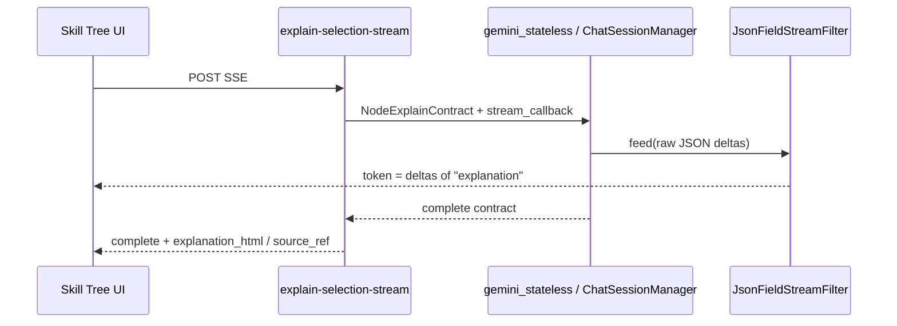

# AI Skill Tree & Tutor Dashboard (UI)

Страница: **http://127.0.0.1:8765/app/skill-tree**

Пайплайны генерации (worker, Targeted / Search-First, Exa, expand): [TUTOR_PIPELINES.md](TUTOR_PIPELINES.md).

## Сборка (один раз после клонирования)

CDN `esm.sh` часто блокируется (CORS/MIME). UI собирается **локально**:

```bash
make skill-tree-ui
# или: ./knowledge_engine/scripts/build-skill-tree-ui.sh
```

Нужны Node.js и npm. Результат: `web/static/skill-tree/skill-tree.bundle.js` (тот же origin, без import map).

## Worker (Gemini / тяжёлый бэкенд)

Генерация маршрута, тьютор ноды, v0.7 runs и async analysis выполняются в **отдельном процессе**:

```bash
make dev          # API + worker
make worker       # только worker (если API уже запущен)
```

`make dev` поднимает API (uvicorn `--reload`) и **worker с auto-reload** (`dev_worker_watch.py`). Reload worker **откладывается**, пока выполняется задача (файл `.runs/worker_dev_busy.json` + running work jobs). Ручной `make worker` — без watcher.

`GET /api/v1/health` → `worker_ok`. Без worker POST `/curriculum/generate` и `/node/*` → 503.

### Redis (очередь + логи)

При `REDIS_URL` (по умолчанию в `make dev`: `redis://127.0.0.1:6379/0`):

- Задачи worker: **pub/sub** канал `ke:tasks` (work jobs, analysis, v07).
- Статусы jobs/runs: ключи в Redis (не `work_jobs.json`).
- Trace прогонов: списки `ke:runlog:{id}` (не `.runs/*.log`).
- Heartbeat: `ke:worker:heartbeat` (TTL).

`GET /api/v1/health` → `redis_ok`, `worker_ok`.

Без Redis — прежний режим: JSON в `.runs/` и poll worker.

Опционально: `KE_WORKER_INLINE_FALLBACK=true` — выполнять в API, если worker не отвечает (не для prod).

## Локальное сохранение (продолжить позже)

| Файл | Содержимое |
|------|------------|
| `knowledge_engine/.runs/skill_tree_curricula.json` | Все учебные графы (Модуль 1) |
| `knowledge_engine/.runs/node_deep_dive_sessions.json` | Контент нод, ссылки, история чата тьютора |

API:

- `GET /api/v1/skill-tree/curricula` — список маршрутов
- `GET /api/v1/skill-tree/curricula/{id}/workspace` — граф + статусы + сессии
- `POST /api/v1/skill-tree/curricula/active` — активный маршрут

В браузере дополнительно: `localStorage` (`ke_skill_tree_active_curriculum`) и URL `?curriculum=...&node=...&material=...` (нода и материал восстанавливаются после перезагрузки).


| Файл | Аналог TSX |
|------|------------|
| `RoadmapDashboard.js` | `RoadmapDashboard.tsx` |
| `RoadmapCanvas.js` | `RoadmapCanvas.tsx` (React Flow) |
| `NodeDrawer.js` | `NodeDrawer.tsx` |
| `NodeTutorChat.js` | `NodeTutorChat.tsx` |
| `SkillNode.js` | кастомная нода графа |

## API

- `POST /api/v1/curriculum/generate`
- `POST /api/v1/node/init` | `/chat` | `/verify`
- `POST /api/v1/node/restart` — полный сброс сессии ноды + повторный `init` (RAG, memory); кнопка **«Пройти заново»** в drawer
- `POST /api/v1/node/suggest-questions` | explain selection (ниже)
- `GET /api/v1/rag-gateway/memory-status`
- `GET /api/v1/node/statuses/{curriculum_id}`

Пайплайны / LangGraph тьютора: [TUTOR_PIPELINES.md](TUTOR_PIPELINES.md). Контракты LLM: [LLM_CONTRACTS.md](LLM_CONTRACTS.md).

---

## Explain selection (выделение в материале)

Код: `services/node_selection_explain.py`. Контракт: `NodeExplainContract` (`explanation`, `cited_source_ids`).

| Endpoint | Доставка |
|----------|----------|
| `POST /api/v1/node/explain-selection` | Синхронный JSON |
| `POST /api/v1/node/explain-selection-stream` | **SSE** (UI): `token` → `complete` \| `error` |

Вне worker / вне tutor LangGraph. Anchor: `node_deep_dive:{curriculum_id}:{node_id}`.

### Приоритет источников `[R*]` vs `[S*]`

| Приоритет | Id | Источник данных |
|-----------|-----|-----------------|
| **1 (primary)** | `[R*]` | `memory.lecture_rag_inspector` — чанки последней dense-лекции; lookup по тегам в выделении / surrounding |
| **2 (fallback)** | `[S*]` | SOURCE REGISTRY ноды (whitelist / grounded URL) — если детали нет в `[R*]` |

Инварианты system (`_NODE_EXPLAIN_SYSTEM`):

1. Не пересказывать выделение.
2. Есть EXACT LECTURE SOURCE CHUNKS / `[R*]` в selection → факты из `[R*]` первыми; `[S*]` только при пробеле.
3. Есть `[Sx]` без matching `[R*]` → механизм из registry snippet.
4. `cited_source_ids` — реальные `R*` и/или `S*`.
5. `source_ref` в API: сначала cited `R*` → inspector row; иначе registry fallback.

Payload: BLOCK 1 (system) / BLOCK 2 (node + registry) / BLOCK 3 (session, RAG chunks, highlight, question) — `interaction_prompt_layout.py`.

### SSE + `JsonFieldStreamFilter`



| Слой | Роль |
|------|------|
| `gemini_json_stream.JsonFieldStreamFilter` | Из partial JSON стримит только дельты строкового поля |
| `structured_stream_text_field(NodeExplainContract)` | → `"explanation"` |
| `iter_node_selection_explain_stream` | Очередь событий `{type: token\|complete\|error}` |
| API | `data: {…}\n\n` (`text/event-stream`) |

Dialogue tutor использует тот же стек, но `TutorDialogueFieldsStreamFilter` (три поля). Каталог: [LLM_CONTRACTS.md](LLM_CONTRACTS.md) § Streaming.

---

## Режимы генерации

- **Fast** → `depth_level: Standard`
- **Consensus** → `depth_level: Deep Mechanics`
