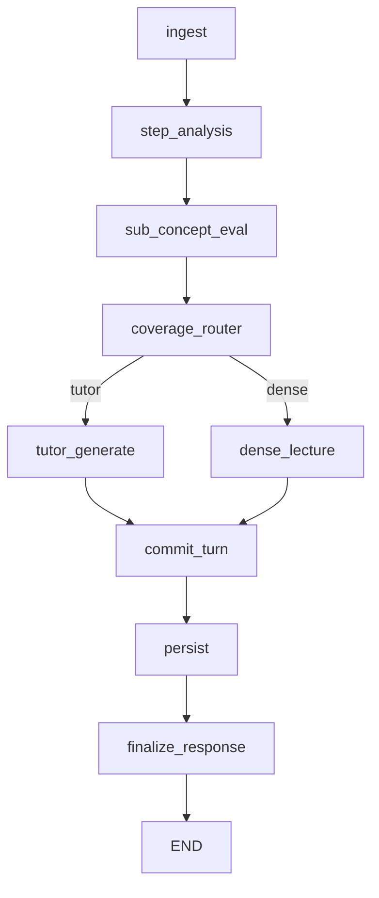

# ADR: Миграция оркестрации Node Deep-Dive на LangGraph

| | |
|---|---|
| **Status** | Accepted (Phase 0/1 scaffolding) |
| **Date** | 2026-08-04 |
| **Related** | [NODE_DEEP_DIVE_MODULE_2.md](NODE_DEEP_DIVE_MODULE_2.md), [TUTOR_PROMPT_AND_UI_TEXT.md](TUTOR_PROMPT_AND_UI_TEXT.md) |

## Context

Оркестрация тьютора сосредоточена в `knowledge_engine/src/node_deep_dive/engine.py` (~1.7k строк): императивный пайплайн `run_node_deep_dive` → `process_user_message_pipeline` → ветки dense / `_invoke_tutor` → `_finalize_node_deep_dive`.

Проблемы:

- **Рассинхронизация coverage:** параллельные треки `sub_concepts` (gap evaluator), `concepts_matrix` (step_analysis) и `verified_sub_concept_ids` из JSON тьютора.
- **Неявная state machine:** `learning_phase` / `learning_mode` / `resolve_interaction_prompt_mode` / `tutor_behavior_state` без единого инварианта переходов.
- **Слабая привязка eval к вопросу** (исторически — infer по тексту; исправлено stored `pending_evaluation_concept_id`, но оркестрация остаётся размазанной).
- **Checkpoint отсутствует** между eval и генерацией тьютора; mid-turn `persist_session_memory` до ответа LLM.

В репозитории LangGraph уже используется для research-пайплайна (`knowledge_engine/graph/v04.py`, `knowledge_engine/src/graph.py`, `EngineGraphState` в `knowledge_engine/schemas.py`). Node Deep-Dive — отдельный домен; граф размещается под `src/node_deep_dive/graph/`.

## Decision

1. **Ввести LangGraph-граф** `build_tutor_graph()` для chat/verify ходов (Фаза 1), с постепенным переносом init/dense (Фаза 2–3).
2. **`engine.py` становится фасадом:** `build_initial_state` → `graph.ainvoke` → `state_to_response`; публичные API `run_node_deep_dive`, `iter_node_deep_dive_chat_stream` не меняются.
3. **Состояние графа:** `TutorGraphState` с вложенным `SessionMemory` как единственным персистентным ядром; эфемерные поля хода — `intent`, `route`, `focus_sub_concept_id`, `llm_out`, и т.д.
4. **Checkpointer:** `MemorySaver` (dev), `thread_id` = `anchor` (`node_deep_dive:{curriculum_id}:{node_id}`); позже SqliteSaver.
5. **Стриминг:** `stream_callback` передаётся через `config["configurable"]`, не через сериализуемый state (как сейчас в `_invoke_tutor`).

### Инварианты (обязательны для всех нод)

| Инвариант | Правило |
|-----------|---------|
| **Single-Writer для VERIFIED sub_concepts** | Менять `memory.sub_concepts[].status` по coverage может **только** нода `sub_concept_eval` (gap eval + согласованные heuristics в `concept_map.process_sub_concept_user_answer`). Тьютор **не** пишет статусы; merge `llm_out.verified_sub_concept_ids` в прод-пути **удаляется** — API отдаёт ids, вычисленные из `sub_concepts`. |
| **Single-Writer для pending** | После реплики тьютора `pending_evaluation_concept_id` выставляет **только** `commit_turn` из `focus_sub_concept_id`, заданного Router на этом ходе. Text-match (`match_sub_concept_id_in_text`) — не источник истины (максимум WARN в логах). |
| **Детерминированный Router** | Нода `coverage_router` **без LLM:** `select_next_sub_concept`, `resolve_interaction_prompt_mode`, `_needs_dense_material`, `sub_concept_coverage_complete`. Следующий `focus_sub_concept_id` не выбирает модель. |
| **Eval scope** | Gap evaluator оценивает **только** `active_question_sub_concept_id` / `pending_evaluation_concept_id` предыдущего хода тьютора. |

## Consequences

### Positive

- Явный DAG и checkpoint между eval и tutor.
- Проще unit-тестировать ноды изолированно.
- Единый стиль с v0.7/v0.4 LangGraph в репозитории.
- Меньше instruction drift: Router не дублирует LLM-решения по тегам.

### Negative / trade-offs

- Два оркестратора на переходный период (engine + graph) до полного cutover.
- Нужны интеграционные тесты на parity ответа API.
- Checkpointer в памяти не переживает рестарт процесса (до Sqlite).

### Risks

- Регрессии streaming/SSE (`api/routes/node_skill.py`).
- Explicit Gemini cache + LangGraph thread — проверить `configurable.thread_id` = anchor.

## File structure

```text
knowledge_engine/src/node_deep_dive/
  graph/
    __init__.py           # build_tutor_graph(), get_compiled_graph()
    state.py              # TutorGraphState
    routing.py            # conditional edge functions
    compile.py            # (Phase 1+) checkpointer singleton
    nodes/
      ingest.py
      step_analysis.py
      sub_concept_eval.py
      coverage_router.py
      tutor_generate.py
      dense_lecture.py      # Phase 2 — в графе, заготовка позже
      commit_turn.py
      persist.py
      finalize_response.py  # Phase 1+
    subgraphs/
      chat_turn.py          # Phase 1 — сборка chat/verify subgraph
      init.py               # Phase 2 — init / lazy intro
  engine.py                 # фасад (сохраняется)
  concept_map.py            # домен coverage (без переноса)
  step_pipeline.py          # step_analysis (обёртка в ноде)
  session_store.py          # persist (нода persist)
```

Доменные модули **не дублируются:** `tutor_prompt_builder.py`, `dialog_context.py`, `gemini_stateless.py`, `memory_schemas.py`.

## Migration phases

| Phase | Scope |
|-------|--------|
| **0** | ADR + scaffolding; опционально `run_chat_turn_steps()` без LangGraph |
| **1** | `chat_turn` subgraph; `engine.run_node_deep_dive` → `ainvoke` для `action in (chat, verify)`; init/dense остаются в engine |
| **2** | Init subgraph; dense в графе; убрать mid-turn persist |
| **3** | Sqlite checkpointer; deprecate imperative path |

## Engine → graph node mapping

Функционал из `engine.py` и соседних модулей:

| Источник (`engine.py` / модуль) | Нода графа | Примечание |
|---------------------------------|------------|------------|
| `run_node_deep_dive` (валидация, ветка action) | `ingest` + top-level routing | init пока вне subgraph (Phase 1) |
| `_ensure_memory`, `_anchor`, загрузка session | `ingest` | `session_store.get_session` |
| `process_user_message_pipeline` (step part) | `step_analysis` | Разрезать: без eval, без append user |
| `process_sub_concept_user_answer` | `sub_concept_eval` | `concept_map.py` |
| `resolve_interaction_prompt_mode`, `_needs_dense_material`, `_lecture_request` | `coverage_router` | Перенести helpers в `routing.py` или импорт из engine |
| `select_next_sub_concept`, `advance_next_question_after_evaluation` | `coverage_router` | После eval — focus для tutor |
| `lecture_coverage`, `generate_dense_material` branch | `dense_lecture` | Phase 2 |
| `_invoke_tutor` | `tutor_generate` | `dialog_context`, `compose_system_prompt` |
| `set_pending_evaluation_for_tutor_turn`, `orchestrate_tutor_llm_output`, append tutor | `commit_turn` | Без merge tutor `verified_sub_concept_ids` |
| `append_to_active_window` (user) | `commit_turn` или отдельный шаг после eval | После разреза pipeline |
| `persist_session_memory`, `sync_session_history_turns` | `persist` | |
| `_finalize_node_deep_dive`, `enrich_node_deep_dive_response` | `finalize_response` | |
| `_invoke_intro_assessment`, `_deliver_lazy_intro` | `subgraphs/init` | Phase 2 |
| `fetch_node_init_rag_facts`, `finalize_node_init_after_grounding` | `subgraphs/init` | Phase 2 |
| `iter_node_deep_dive_chat_stream` | `engine` фасад | `configurable.stream_callback` |
| `advance_phase_after_chat` | `coverage_router` или `commit_turn` | Детерминированно по intent + coverage |
| `build_mastery_dashboard`, `build_coverage_summary` | `finalize_response` | |

## Chat-turn DAG (target)



## Streaming contract

Без изменения SSE в `api/routes/node_skill.py`:

```python
await graph.ainvoke(
    state,
    config={
        "configurable": {
            "thread_id": anchor,
            "stream_callback": on_token,
        }
    },
)
```

Только `tutor_generate` (и позже `dense_lecture` для `lecture_body`) читает callback.

## References

- `knowledge_engine/graph/v04.py` — образец `StateGraph` + `conditional_edges`
- `knowledge_engine/schemas.py` — `EngineGraphState` (TypedDict + NotRequired)
- `knowledge_engine/src/node_deep_dive/concept_map.py` — coverage domain
- `knowledge_engine/src/node_deep_dive/graph/` — scaffolding (`state.py`, `routing.py`, `nodes/`, `build_tutor_graph`)
