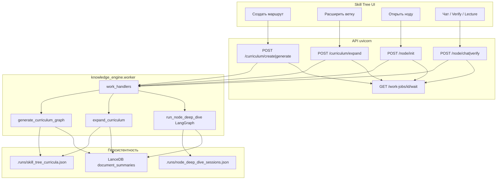
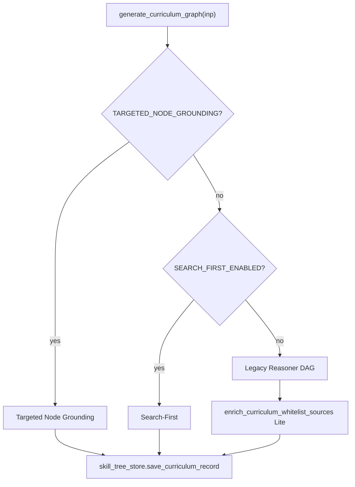
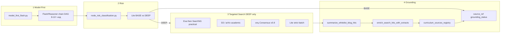
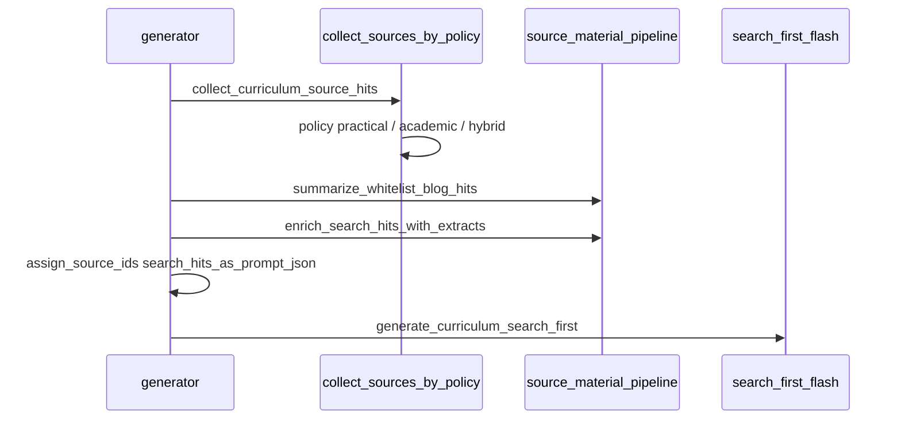
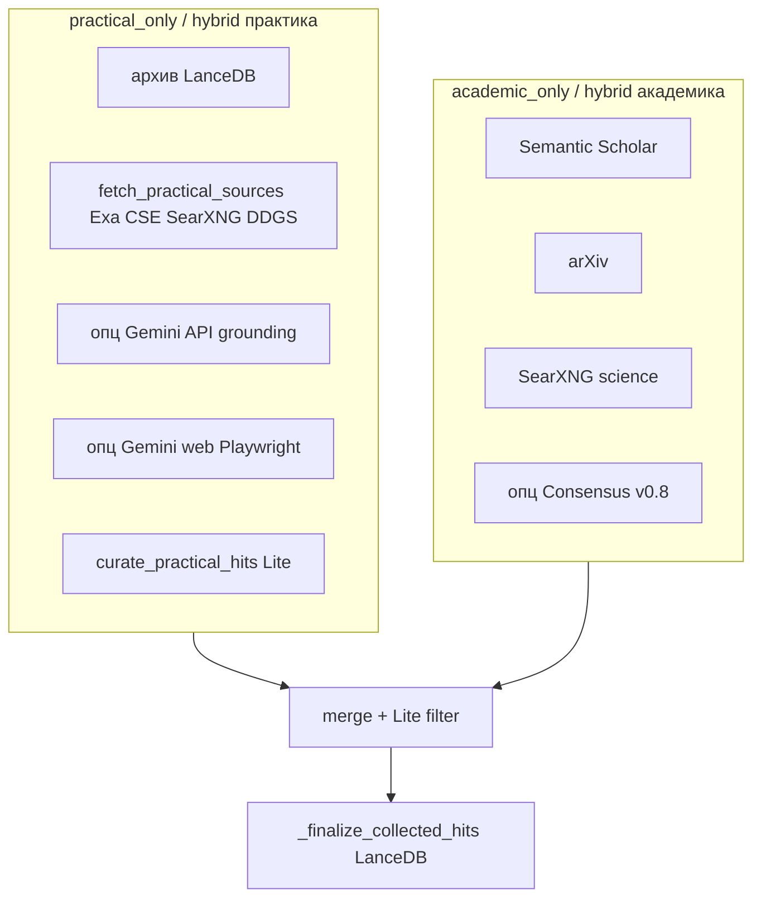
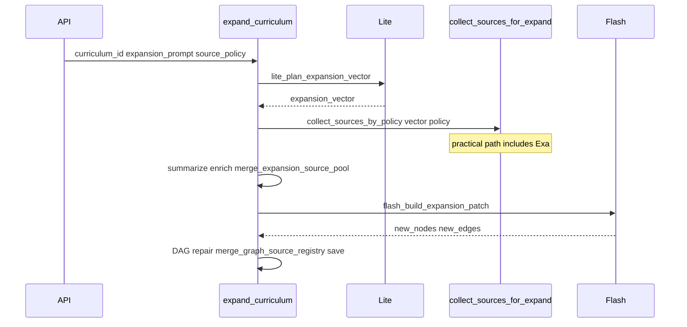
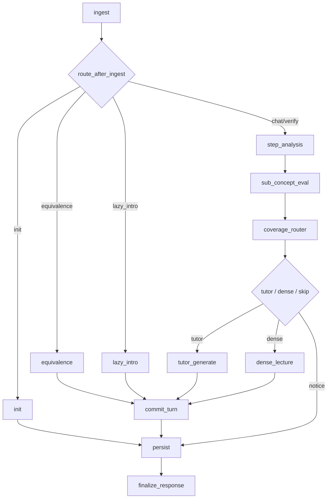

# AI Skill Tree & Tutor — пайплайны генерации

Живая карта: как UI, API, worker и модели собирают учебный граф и контент ноды.

**Когда обновлять этот файл:** смена ветвления в `generator.py`, новый провайдер поиска (Exa, SearXNG, …), правки `source_material_pipeline`, Targeted vs Search-First, expand, init/chat тьютора.

**См. также:**

| Документ | Тема |
|----------|------|
| [INDEX.md](INDEX.md) | Каталог docs + аудит пробелов |
| [SKILL_TREE_UI.md](SKILL_TREE_UI.md) | UI, worker, Redis, explain SSE |
| [CURRICULUM_MODULE_1.md](CURRICULUM_MODULE_1.md) | API Modуль 1, env по источникам |
| [NODE_DEEP_DIVE_MODULE_2.md](NODE_DEEP_DIVE_MODULE_2.md) | Тьютор ноды, память, фазы |
| [LECTURE_RAG_CONTEXT.md](LECTURE_RAG_CONTEXT.md) | Плотная лекция: LanceDB → CE → MMR |
| [TUTOR_PROMPT_AND_UI_TEXT.md](TUTOR_PROMPT_AND_UI_TEXT.md) | Compositor, manifest, JSON в UI |
| [LLM_CONTRACTS.md](LLM_CONTRACTS.md) | Реестр Pydantic Gemini contracts |
| [EXA_SEARCH.md](EXA_SEARCH.md) | Exa: query plan, rank, domains, EXA_* |
| [ACADEMIC_AND_CONSENSUS.md](ACADEMIC_AND_CONSENSUS.md) | Papers: sanitize, SS/arXiv, Consensus harvest |
| [ARTICLE_DIAGRAMS.md](ARTICLE_DIAGRAMS.md) | Схемы источников: ingestion, VLM, Mermaid и нода |
| [SOURCE_POOL.md](SOURCE_POOL.md) | Провайдеры и квоты |
| [ARCHITECTURE_DEDUP.md](ARCHITECTURE_DEDUP.md) | Где единая точка сбора источников |
| [RAG_GATEWAY_MODULE_3.md](RAG_GATEWAY_MODULE_3.md) | Directional RAG на init/chat |

Страница UI: `http://127.0.0.1:8765/app/skill-tree`

---

## 1. Общая схема продукта



Без живого worker `POST /curriculum/*`, `POST /node/*` и RAG-gateway → **503**. `KE_WORKER_INLINE_FALLBACK` больше не исполняет ML в API. `GET /api/v1/health` → `worker_ok`.

Очередь: `api/helpers/work_enqueue.py` → `services/work_job_store.py` (или Redis pub/sub при `REDIS_URL`).

---

## 2. Параметры генерации графа

### API body (`POST /api/v1/curriculum/generate`, alias `/create`)

| Поле | Роль |
|------|------|
| `target_goal` | Цель курса, якорь логов, поисковые запросы |
| `source_policy` | `hybrid` \| `practical_only` \| `academic_only` |
| `generation_mode` | Legacy: `consensus` → если policy не задан, `academic_only` |
| `depth_level` | `Overview` \| `Standard` \| `Deep Mechanics` |
| `user_level` | Подсказка для промптов |

Резолв policy: `src/curriculum/source_policy.py` (`resolve_source_policy`, `normalize_source_policy`).

### UI (Skill Tree)

Типичные сочетания: Fast + hybrid/practical; Consensus в UI часто мапится на `academic_only` + `generation_mode=consensus` (`web/static/skill-tree/api.js`).

### Env — выбор **ветки** create

| Env | Default | Ветка |
|-----|---------|--------|
| `CURRICULUM_TARGETED_NODE_GROUNDING_ENABLED` | `true` | Targeted Node Grounding |
| `CURRICULUM_SEARCH_FIRST_ENABLED` | `false` | Search-First (если targeted выключен) |
| иначе | — | Legacy Reasoner + Lite whitelist |

Другие важные env: `EXA_API_KEY`, `EXA_SEARCH_ENABLED`, `CURRICULUM_USE_V08_CONSENSUS`, `CURRICULUM_GEMINI_GROUNDING_ENABLED`, `SEARXNG_ENABLED` — см. [EXA_SEARCH.md](EXA_SEARCH.md), `.env.example` и [SOURCE_POOL.md](SOURCE_POOL.md).

---

## 3. Роутинг create: три пайплайна

Точка входа: `src/curriculum/generator.py` → `generate_curriculum_graph`.



Worker: `services/work_handlers.py` → `_run_curriculum_generate` → `generate_curriculum_graph`.

---

## 4. Пайплайн A — Targeted Node Grounding (дефолт)

**Идея:** DAG без URL → Lite риск → веб-поиск только для DEEP → grounding в реестр и ноду.



| Этап | Модуль | Модели / IO |
|------|--------|-------------|
| Model-First | `model_first_flash.py` | Gemini structured, без URL |
| Risk | `node_risk_classification.py` | Lite structured |
| Targeted search | `targeted_node_search.py` | Exa (`practical_source_fetch`), SearXNG, academic fetch, опц. Consensus |
| Материалы | `source_material_pipeline.py` | Ollama summarizer (пропуск при `skip_ollama_summary`), LanceDB |
| Склейка | `targeted_node_grounding.py` | лучший approved hit → нода |

**Статусы нод после create:**

| Risk | Поиск | `grounding_status` |
|------|--------|-------------------|
| BASE | нет | `model_only` |
| DEEP | hit найден | `grounded` + `source_ref` |
| DEEP | пусто / Lite reject | `unverified_deep` (нода сохраняется) |

**`source_policy` на DEEP-поиск:**

- `practical_only` — Exa → SearXNG, whitelist blogs
- `academic_only` — Semantic Scholar, arXiv, опц. Consensus
- `hybrid` — practical + academic, merge, Lite strict

Запрос на ноду: `targeted_node_search._node_search_goal` (цель + title + core_concepts + summary).

---

## 5. Пайплайн B — Search-First (legacy)

Условие: `CURRICULUM_TARGETED_NODE_GROUNDING_ENABLED=false` и `CURRICULUM_SEARCH_FIRST_ENABLED=true`.



Единая точка сбора: `source_material_pipeline.collect_sources_by_policy` (тот же код, что smoke `--with-collect`).

### Сбор источников по policy



Search-First **не** делает отдельный этап BASE/DEEP на графе — Flash строит полный DAG из пула `key_extracts`.

---

## 6. Пайплайн C — Legacy Reasoner

Если не Targeted и не Search-First:

1. `generator._generate_legacy_reasoner` — Reasoner chain + whitelist в system prompt.
2. `enrich_curriculum_whitelist_sources` — Lite к нодам.
3. `validate_curriculum_dag`.

Предсбор Exa/SearXNG на create **не** выполняется.

---

## 7. Расширение графа (Expand)

`POST /api/v1/curriculum/expand` → worker → `services/curriculum_service.expand_curriculum`.



Expand **не** перезапускает Targeted Grounding для существующих нод; добавляет ветку через Flash patch. Код: `src/curriculum/curriculum_expansion.py`.

---

## 8. Тьютор ноды (контент урока, Модуль 2)

Не создаёт curriculum DAG. Оркестрация — **LangGraph** (`get_compiled_tutor_graph().ainvoke`), фасад `run_node_deep_dive`. Полная карта: [NODE_DEEP_DIVE_MODULE_2.md](NODE_DEEP_DIVE_MODULE_2.md).

**Инварианты потока**

| | |
|--|--|
| Entry | `engine.run_node_deep_dive` → graph |
| `thread_id` | `anchor` = `node_deep_dive:{curriculum_id}:{node_id}` |
| Checkpoint | `MemorySaver` (in-process) |
| Single-writer coverage | статусы `sub_concepts` пишет только `sub_concept_eval`; tutor LLM не мутирует карту |



| Action | API | Путь в графе |
|--------|-----|--------------|
| `init` | `POST /node/init` | `ingest` → `init` → `persist` → `finalize_response` |
| `chat` / `verify` | `POST /node/chat`, `/verify` | `ingest` → (опц. `equivalence` / `lazy_intro`) → `step_analysis` → `sub_concept_eval` → `coverage_router` → `tutor_generate` \| `dense_lecture` → `commit_turn` → `persist` → `finalize_response` |

Режимы в `user_message`: `[mode:lecture]`, `[mode:blitz]`, `[mode:socratic]` → `coverage_router` / `interaction_mode`.

RAG: `src/rag_gateway` + LanceDB; dense — [LECTURE_RAG_CONTEXT.md](LECTURE_RAG_CONTEXT.md). Сессии: `.runs/node_deep_dive_sessions.json`.
Диаграммы источников: [ARTICLE_DIAGRAMS.md](ARTICLE_DIAGRAMS.md).

Синхронно в API (вне graph): `POST /node/suggest-questions`, `POST /node/explain-selection-stream` (SSE).  
Explain: `[R*]` из `lecture_rag_inspector` приоритетнее `[S*]` registry — [SKILL_TREE_UI.md](SKILL_TREE_UI.md) § Explain, [LLM_CONTRACTS.md](LLM_CONTRACTS.md).

---

## 9. Карта функций → файлы

| Функция | Файл |
|---------|------|
| API create / expand | `api/routes/curriculum.py` |
| Очередь | `api/helpers/work_enqueue.py` |
| Worker jobs | `services/work_handlers.py`, `services/work_job_store.py` |
| Роутинг create | `src/curriculum/generator.py` |
| Targeted grounding | `src/curriculum/targeted_node_grounding.py` |
| Model-First | `src/curriculum/model_first_flash.py` |
| Risk | `src/curriculum/node_risk_classification.py` |
| DEEP search | `src/curriculum/targeted_node_search.py` |
| Сбор по policy | `src/curriculum/source_material_pipeline.py` |
| Practical fetch + Exa | `src/curriculum/practical_source_fetch.py` |
| Exa provider | `services/search/providers.py`, `exa_client.py`, `exa_transform.py` |
| Search registry | `services/search/registry.py` |
| Search-First Flash | `src/curriculum/search_first_flash.py` |
| Expand | `services/curriculum_service.py`, `curriculum_expansion.py` |
| Сохранение графа | `services/skill_tree_store.py` |
| Тьютор (фасад + graph) | `src/node_deep_dive/engine.py`, `src/node_deep_dive/graph/` |

---

## 10. Логи и отладка

Trace: `ui/run_log.py` → файл `.runs/*.log` или Redis `ke:runlog:*`.

| Маркер в trace | Этап |
|----------------|------|
| `WORKER curriculum generate` | Job create |
| `CURRICULUM targeted grounding ▶` | Targeted pipeline |
| `CURRICULUM exa ▶` / `targeted practical ✓ exa=` | Exa |
| `CURRICULUM search prestep` | Search-First сбор |
| `CURRICULUM expand ▶` | Expand |
| `NODE_DIVE этап 1/2 RAG` | Init ноды |
| `CURRICULUM unverified_deep` | DEEP без источника |

Полный LLM trace: `KE_LLM_FULL_TRACE=true` (см. `ui/llm_trace.py`).

Smoke без полного графа:

```bash
cd knowledge_engine
python scripts/smoke_curriculum_sources.py --goal "ваша тема" --policy practical_only
python scripts/smoke_curriculum_sources.py --goal "ваша тема" --policy hybrid --with-collect
```

Search-First trace run: `scripts/run_curriculum_search_first.py`.

---

## 11. Чеклист прогона (Exa + дефолт Tutor)

1. `EXA_API_KEY`, `EXA_SEARCH_ENABLED=true`, `pip install exa-py`.
2. `make dev` — API + worker с reload.
3. UI: `source_policy` **hybrid** или **practical_only**.
4. Дефолт Targeted Grounding — Exa на **DEEP**-нодах (после Lite risk).
5. Дождать `GET /api/v1/work-jobs/{job_id}/wait` после create.
6. Проверить trace / `exa=` в логах для DEEP-нод.

---

## 12. История изменений (вручную)

| Дата | Изменение |
|------|-----------|
| 2026-07-30 | Consensus matrix: academic_consensus, fetch_academic_sources_async |
