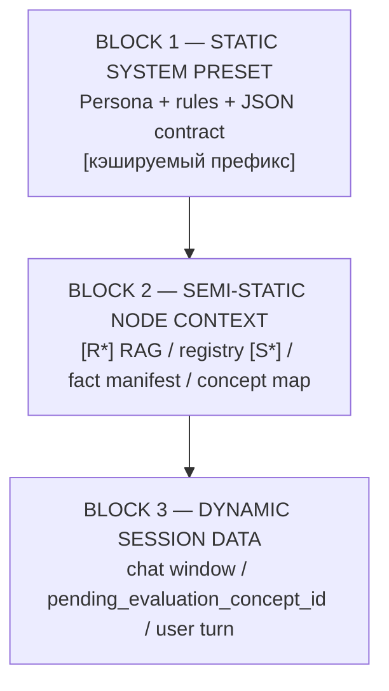

# Тьютор: промпты, контракт, UI-текст

Дополнение к [NODE_DEEP_DIVE_MODULE_2.md](NODE_DEEP_DIVE_MODULE_2.md). Контракты: `schemas/llm_contracts/tutor.py`.

---

## Structured contract (`DeepDiveTutorContract`)

Источник истины для chat/verify dialogue и `lecture_chat`: Pydantic-схема в `schemas/llm_contracts/tutor.py`. Runtime-объект ответа: `DeepDiveLLMOutput` (`schemas.py`) — те же semantic fields.

| Поле | Роль |
|------|------|
| `feedback_on_answer` | Реакция / разбор предыдущего ответа пользователя |
| `technical_explanation` | Инженерный разбор **без** «?» и без анонса следующей подтемы |
| `follow_up_question` | Подводка + вопрос по следующей подтеме (с «?») |
| `question_sub_concept_id` | Id из concept map для `follow_up_question` → `commit_turn` пишет `pending_evaluation_concept_id` |
| `verified_sub_concept_ids` | **Не writer карты** — в API подменяется списком из `memory.sub_concepts` |
| `ready_for_transition` / `suggested_next_step` | Закрытие темы (`next_node` \| `deep_dive_optional`) |
| Panel | `summary`, `referenced_diagram_id` → server resolves into `content.diagram` / `content.diagrams`, `references`, `node_status`, `introduced_terms`, `new_gap_to_record` |

### `tutor_message` — устарел в LLM-контракте

- В `DeepDiveTutorContract` / system rules (`dialogue_prompt_en.py`): **поля `tutor_message` нет** («Do NOT include a `tutor_message` field»).
- Текст для UI/history: `compose_tutor_dialogue_from_output` = склейка `feedback_on_answer` + `technical_explanation` + `follow_up_question` (`tutor_dialogue.py`).
- API `NodeDeepDiveResponse.tutor_message` — **display-агрегат**, не отдельное LLM-поле.
- Intro по-прежнему использует `IntroAssessmentContract.tutor_message` (отдельный контракт).
- Dense lecture: `StructuredLectureResponse.lecture_body` (не dialogue triple).

---

## Режимы взаимодействия (`interaction_mode`)

Enum: `InteractionPromptMode` (`prompt_types.py`). Резолв: `resolve_interaction_prompt_mode` → пишет `coverage_router` в `TutorGraphState.interaction_mode`.

| Mode | Когда | System source | Контракт ответа |
|------|-------|---------------|-----------------|
| `dialogue_feedback` | Обычный chat/verify (пошаговая оценка) | `dialogue_prompt_en.py` | `DeepDiveTutorContract` |
| `lecture_chat` | Q&A в контексте уже выданной лекции | `lecture_prompt_en.py` | `DeepDiveTutorContract` (без `tutor_message`) |
| `lecture_dense` | Авто-резюме / полная лекция | `lecture_prompt_en.py` + dense rules | `StructuredLectureResponse` |
| `intro` | Intro assessment / lazy intro | `lecture_prompt_en.py` | `IntroAssessmentContract` |

Сборка system: `tutor_prompt_builder.compose_system_prompt(mode, …)`.

| UI prefix в `user_message` | Эффект |
|----------------------------|--------|
| `[mode:lecture]` | learning_mode + часто `dense` route |
| `[mode:blitz]` / `[mode:socratic]` | learning_mode; prompt mode обычно dialogue |

**Язык:** system — EN; runtime output fields — RU (`RUSSIAN_OUTPUT_RULE`).

---

## Архитектура промпта (cache-friendly blocks)

Константы и заголовки: `interaction_prompt_layout.py`.
Цель — **явный префиксный кэш Gemini**: стабильный префикс слева, волатильный хвост справа.



| Блок | Содержимое (инвариант) | Где собирается |
|------|------------------------|----------------|
| **1** | EN system core + persona + formatting / citation / JSON field rules | `compose_system_prompt` / `BLOCK_STATIC_PRESET_HEADER`; dense: `build_dense_system` |
| **2** | Semi-static ноды: `[R*]` chunks, `[S*]` registry, node materials, fact manifest, `[CURRENT_CONCEPT_MAP]` | Dense/explain user payload: `BLOCK_SEMI_STATIC_HEADER`; dialogue: layer1 + layer2 (`dialog_context.py`) |
| **3** | История чата (`sliding_window` / shared session), `pending_evaluation_concept_id` (через concept map / behavior), ход пользователя | `BLOCK_DYNAMIC_HEADER` / `build_dynamic_suffix` / `build_shared_session_context_block` |

Потребители явной BLOCK 1–3 разметки:

- Dense lecture user payload — `lecture_rag_context` (block2 → block3; block1 в system).
- Selection explain — `node_selection_explain.py` (`NodeExplainContract`; `[R*]` > `[S*]` — [SKILL_TREE_UI.md](SKILL_TREE_UI.md)).
- Dialogue chat: эквивалент трёх слоёв через **Explicit Cache layers** (layer1 / layer2 / dynamic suffix) — см. [NODE_DEEP_DIVE_MODULE_2.md](NODE_DEEP_DIVE_MODULE_2.md).

Стриминг structured JSON: `JsonFieldStreamFilter` / dialogue filter — [LLM_CONTRACTS.md](LLM_CONTRACTS.md).

Правила цитирования (`PROMPT_CITATION_ID_RULES`): в output только реальные id `[R*]`, `[S*]`, `[Diagram N]` — не мета-теги блоков.

`CRITICAL_RULES_RECENCY` — один раз в хвосте system / dynamic suffix, не дублировать в compositor.

---

## Prompt compositor (точки входа)

| Функция | Mode |
|---------|------|
| `build_intro_system()` | `intro` |
| `build_dialogue_system()` | `dialogue_feedback` |
| `build_lecture_chat_system()` | `lecture_chat` |
| `build_dense_system(...)` | `lecture_dense` |

Whitelist / grounded architecture / neighborhood — в compositor, не дублировать в hot payload.

**Sub-concept coverage в payload:** `format_concept_map_for_tutor` → блок карты; eval scope = `pending_evaluation_concept_id` предыдущего хода.

---

## Step analysis (sidecar, не tutor contract)

`step_pipeline.py` / нода `step_analysis`: Lite `StepAnalysisContract` (`intent`, `concept_updates`, `critical_gap`) → `concepts_matrix`. Gap coverage — отдельный `SubConceptGapEvalContract` в `sub_concept_eval`.

При вытеснении окна — fact manifest (`DialogueFactManifestContract`), не full rolling compress на каждый turn.

---

## Отображение trade-off JSON в UI

LLM иногда вставляет сырой JSON в prose. Repair:

| Слой | Модуль |
|------|--------|
| Backend | `repair_structured_analysis_json()` → `llm_markdown_service.llm_markdown_to_html` |
| Skill Tree fallback | `structuredAnalysisToHtml()` в `web/static/skill-tree/llmTextRepair.js` |

Панель и чат предпочитают `summary_html` / `contentHtml`.

## Skill Tree bundle

После правок в `web/static/skill-tree/*.js`:

```bash
cd knowledge_engine/web/static/skill-tree && npm run build
```
